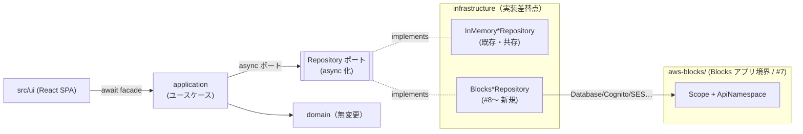
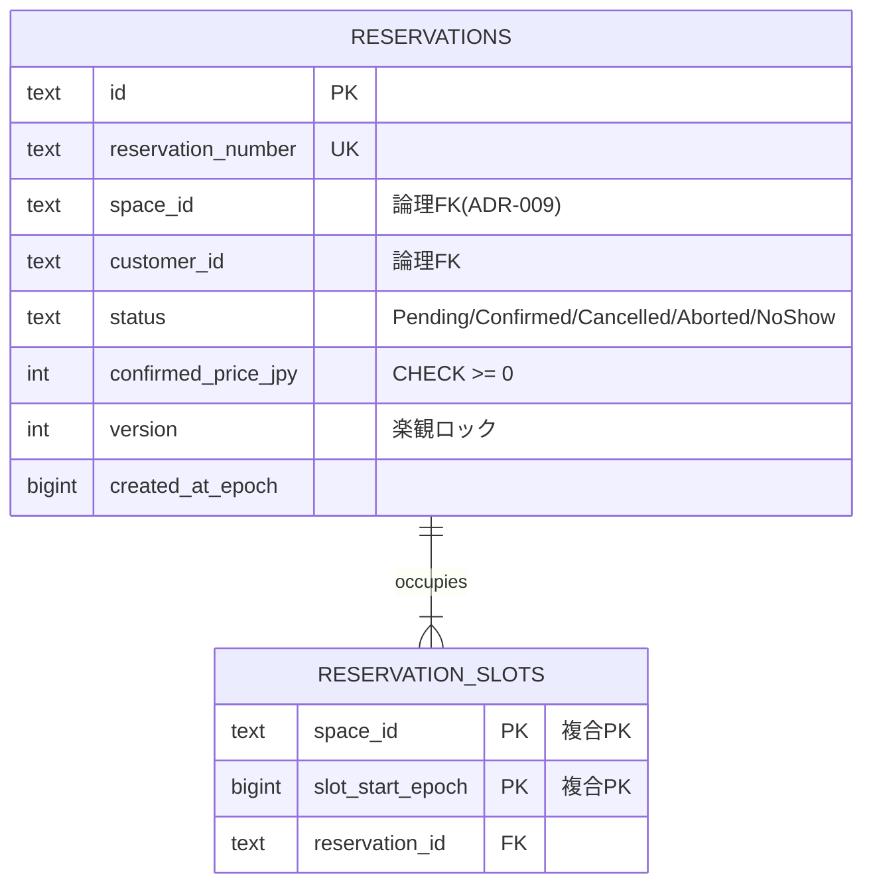
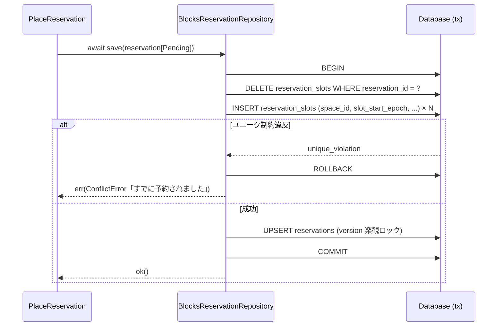

# 設計書: AWS Blocks 移行のための非同期ポート化と永続化

| 項目 | 内容 |
|---|---|
| ステータス | Review |
| 作成日 | 2026-06-27 |
| 要件定義書 | docs/requirements/rental-space-booking.md（FR-010/012/013/019/032, NFR-003/006） |
| 関連設計書 | docs/design/rental-space-booking.md（§4 永続化, ADR-002/003/009） |
| 対象 Issue | #8〜#15 の前提設計（トラッキング #16） |

## 1. 設計概要

AWS Blocks の Building Block（`Database`=Aurora/PGlite, `bb-auth-cognito`, `bb-email-client` ほか）を
**ポートの実装（インフラ層）として採用**する。最大の障害は、現在のリポジトリポートが**同期**
（`save(): Result`, `byId(): Reservation | undefined`）であるのに対し、AWS Blocks のデータ操作が
**すべて async（Promise）**である点。本設計は次を確定する。

1. **リポジトリポートを async 化**する（戻り値を `Promise<...>` 化）。波及をアプリ層→facade→UI→テストへ段階伝播させる（ADR-AB01）。
2. **既存設計 §4 の論理モデル（部分ユニークインデックス）を Postgres の物理スキーマに落とす**。ダブルブッキング防止を DB 制約として強制（ADR-AB02/AB04）。
3. **インメモリ実装と Blocks 実装を同じ async ポートの下で共存**させ、`createContainer({ backend })` で切替（#7 で導入済みのシーム）（ADR-AB03）。
4. **段階移行順序とテスト戦略**を定義（ADR-AB05）。ドメイン層（純TS, 集約/VO/ドメインサービス）は**全 Issue を通じて無変更**。

> ドメインの不変条件・状態モデル・占有の考え方（占有はリポジトリが強制）は既存設計のまま。
> 変えるのは「ポートの戻り値の型（同期→Promise）」と「インフラ実装の中身（Map→SQL）」だけ。

## 2. コンテキストマップ

コンテキスト分割・依存方向は既存設計から不変。変わるのは各コンテキストの **infrastructure 層の実装**と、
新設する **AWS Blocks アプリ境界（`aws-blocks/`）**。

### コンテキスト間の連携一覧

| 発信元 | 宛先 | 経路 | 内容 |
|---|---|---|---|
| application | infrastructure | async ポート（Promise） | リポジトリ/アダプタ呼び出し |
| Blocks*Repository | aws-blocks/Scope | Building Block API | 実 I/O（SQL 等） |
| 変更なし（booking↔space↔customer の越境） | | 型付きID / DTO / イベント | 既存どおり（ADR-009 維持） |

## 3. ドメインモデル

**無変更。** 集約（Reservation / Space / Customer）・値オブジェクト・ドメインサービス・ドメインイベントは
既存設計のまま。占有一意性は引き続き「ドメインの集約には持たせず、リポジトリ（インフラ）が強制」する
（ADR-002 を踏襲）。本設計はドメインの API には触れない。

唯一の影響: ポートはドメイン/アプリ層に属するため、**ポート interface の戻り値型のみ** async へ変わる
（実体ロジックではなく型シグネチャの変更）。

## 4. 永続化設計（物理モデル）

既存設計 §4 の論理モデルを `@aws-blocks/bb-data`（Postgres。ローカルは PGlite、AWS は Aurora Serverless v2）の
物理スキーマに落とす。マイグレーションは `aws-blocks/migrations/NNN_*.sql`（適用は `_migrations` で冪等管理）。

### テーブル定義

**reservations** — 予約集約のスナップショット。
- `id TEXT PRIMARY KEY` / `reservation_number TEXT UNIQUE NOT NULL`
- `space_id TEXT NOT NULL` / `customer_id TEXT NOT NULL`（**論理FK。コンテキスト越境のため物理FKは張らない**, ADR-009）
- `status TEXT NOT NULL`（永続状態のみ。`Completed` は導出, ADR-004）
- `confirmed_price_jpy INTEGER NOT NULL CHECK (confirmed_price_jpy >= 0)`（確定時スナップショット, ADR-006）
- キャンセルポリシースナップショット列 / `payment_ref` / `created_at_epoch BIGINT NOT NULL`
- `version INTEGER NOT NULL`（状態遷移競合検出の楽観ロック）

**reservation_slots** — **アクティブ占有のみ**を保持する占有テーブル（核心制約の物理化）。
- `space_id TEXT NOT NULL` / `slot_start_epoch BIGINT NOT NULL`
- `reservation_id TEXT NOT NULL REFERENCES reservations(id) ON DELETE CASCADE`（**同一モジュール内なので物理FK可**）
- `PRIMARY KEY (space_id, slot_start_epoch)` ← **この主キー自体がダブルブッキング不可を強制**

> 設計判断: 占有テーブルには「現在 Pending/Confirmed のスロット行」だけを置く。Cancelled/Aborted へ
> 遷移したらその予約の占有行を**削除**する。これにより部分述語インデックスではなく**通常の複合PK**で
> 一意性を表現でき、既存インメモリの `occupancy` Map（アクティブのみ保持）と意味的に一致する（ADR-AB02）。
> 代替として `reservation_slots` を全状態保持 + `WHERE status IN (...)` の部分ユニークインデックスにする案も
> あるが、別テーブルの status を参照できず status 列の非正規化と同期が必要になるため採らない。

### インデックス

| テーブル | インデックス | 根拠となる想定クエリ |
|---|---|---|
| reservation_slots | PK (space_id, slot_start_epoch) | 占有確保の競合検知（FR-013）／空き枠照会 `occupiedSlots`（FR-010） |
| reservations | UNIQUE (reservation_number) | `byNumber`（照会, FR-016） |
| reservations | (customer_id) | `byCustomer`（マイ予約, FR-016） |
| reservations | (status, created_at_epoch DESC) | 管理者横断一覧（FR-019, オフセットページング） |
| reservations | (status, <slot_start>) | リマインド対象抽出 `confirmedStartingBetween`（FR-032） |

## 5. アプリケーション API（async 化の影響範囲）

### ポート signature 変更（同期 → Promise）

| ポート | 変更 |
|---|---|
| `ReservationRepository` | 全7メソッドを `Promise<...>` 化（`save`/`byId`/`byNumber`/`byCustomer`/`occupiedSlots`/`list`/`confirmedStartingBetween`） |
| `SpaceRepository` | 同上（#9） |
| `CustomerRepository` | 同上（#10） |
| `SpaceCatalogPort` / `CustomerDirectoryPort` | 参照系を Promise 化 |

### 波及（呼び出し側を `await` 化＝async 化）

| 層 | 対象 | 影響 |
|---|---|---|
| application | `SearchAvailability` `QuoteReservation` `PlaceReservation` `CancelReservation` `LookupReservation` `ListMyReservations` `ListAllReservations` `ForceCancelReservation` `MarkNoShow` `TriggerReminders` ほか | `execute()` が async に |
| composition | `webFacade` | `quote`/`searchAvailability`/`lookup`/`listMyReservations`/admin系を async 化（`place`/`cancel` は既に Promise） |
| ui | 各ページの呼び出し | `await` 追加。React 側はローディング状態を持つ箇所のみ調整 |
| test | 既存54件 | `await` 付与。アサーションは不変 |

### エラーレスポンス規約 / ページネーション方針

既存規約を踏襲（`Result<T, AppError>`、オフセットページング）。async 化で型は `Promise<Result<...>>` になるが
構造は不変。`ConflictError`「すでに予約されました」は DB のユニーク制約違反を写像して返す。

## 6. 主要シーケンス

### 6-1. 予約作成における占有のアトミック確保（Blocks/Database, FR-012/013）

占有確保と予約行更新を**単一トランザクション**で行い、占有の一段階アトミック確保（ADR-003）を物理保証する。
`version` 不一致は `IllegalState`（状態遷移競合）として返す。

## 7. ADR（設計判断の記録）

### ADR-AB01: リポジトリポートを async（Promise）化する
- **ステータス**: Accepted
- **コンテキスト**: AWS Blocks のデータ操作はすべて async。現行ポートは同期で、Blocks 実装が物理的に不可能。
- **決定**: ポート interface の戻り値を `Promise<...>` 化し、application→facade→UI→test へ `await` を伝播。インメモリ実装も async ポートを満たす（`Promise.resolve` ラップ。JS 単一スレッドのアトミック性は1つの async 関数内で `await` を挟まなければ維持される）。
- **検討した代替案**:
  - *同期維持*: Blocks 採用不可。却下。
  - *async/sync の並行ポート*: ドメインに2系統のポートが生まれ、ユースケースが実装系統に依存。DDD 上不健全。却下。
  - *deasync 等で同期化*: ランタイム的に脆く本番不可。却下。
- **トレードオフ**: 変更ファイル数が多い（広く浅い機械的変更）。UI のローディング表現の見直しが一部必要。

### ADR-AB02: ダブルブッキング一意性を「アクティブ占有テーブルの複合PK」で物理強制
- **ステータス**: Accepted（既存 ADR-002 の物理実装）
- **コンテキスト**: FR-013。在庫一意性は集約に持たせずインフラが強制（ADR-002）。
- **決定**: `reservation_slots` に**アクティブな占有行のみ**を置き、`PRIMARY KEY (space_id, slot_start_epoch)` で一意性を強制。解放は行削除。
- **検討した代替案**: 全状態保持＋部分ユニークインデックス `WHERE status IN (...)`。別テーブル status を参照できず非正規化＋同期が必要。却下。
- **トレードオフ**: 占有テーブルと予約 status の整合をトランザクションで担保する責務がリポジトリに残る（6-1 で担保）。

### ADR-AB03: インメモリ実装と Blocks 実装を同一 async ポート下で共存
- **ステータス**: Accepted
- **コンテキスト**: NFR-003/006。学習・テスト・デモはインメモリで完結させたい。
- **決定**: 両実装が同じ async ポートを実装し、`createContainer({ backend: "memory" | "blocks" })` で切替（#7 シーム）。既存インメモリ実装は削除しない。
- **検討した代替案**: インメモリ撤去し Blocks 一本化。AWS アカウント/PGlite 起動が前提になり学習用途を損なう。却下（Preview 段階では特に）。
- **トレードオフ**: 同一ポートの2実装を維持するコスト。共通の契約テスト（同一テストを両実装に流す）で担保。

### ADR-AB04: 占有確保＋予約更新を単一トランザクション＋楽観ロックで原子化
- **ステータス**: Accepted（既存 ADR-003 の物理実装）
- **コンテキスト**: FR-013 シナリオ2（横取り）を構造排除する必要。
- **決定**: `BEGIN → 占有 DELETE/INSERT → reservations UPSERT(version 検査) → COMMIT`。ユニーク違反=ConflictError、version 不一致=IllegalState。
- **検討した代替案**: アプリ層での read-modify-write ＋ 後追いチェック。競合窓が残る。却下。
- **トレードオフ**: トランザクション境界がリポジトリ実装に閉じる（ポートはトランザクションを露出しない）。

### ADR-AB05: 段階移行順序と契約テスト
- **ステータス**: Accepted
- **コンテキスト**: 一括変換は巨大 PR になり検証が困難。
- **決定**: #8 予約DB → #9 スペースDB → #10 認証 → #11 通知 → #12 リマインド → #13 ジョブ → #14 決済 → #15 フロント統合。各 PR で「ポート async 化＋当該実装＋呼び出し側 await ＋テスト await」を**そのコンテキストに閉じた範囲**で行う。リポジトリは**契約テスト**（同一仕様テストをインメモリ/Blocks 両実装に適用）で同値性を保証。ローカルは PGlite モックで AWS 不要。
- **検討した代替案**: 全ポート一括 async 化を1 PR。レビュー不能。却下。
- **トレードオフ**: 移行途中はポートごとに async/sync が混在する期間が生じる（コンテキスト単位で閉じるため実害は限定的）。

### ADR-AB06: 通知の Email Block 化 — fire-and-forget 送信と PII 宛先解決の分離（#11）
- **ステータス**: Accepted
- **コンテキスト**: `NotificationPort.send` は同期だが Email Block(SES) は async。かつ NFR-002 によりメッセージにはマスク済み PII しか載せられない一方、SES 実送信には実アドレスが必要。本リポジトリは公開のため実アドレスへの外部送信は避けたい。
- **決定**:
  1. **`NotificationPort.send` を `Promise<void>` 化**。ただし EventBus は同期のまま保ち、購読側（`NotificationHandlers`）は**結果整合のため fire-and-forget**（`void send().catch()`）で呼ぶ。発火元トランザクションを送信遅延に結合させない。booking ユースケース群や `publish` 呼び出し側は無変更（#8 の非同期化と作業が被らない）。
  2. **実宛先は `EmailRecipientResolver` ポート（通知が所有・Customer が実装供給）で送信直前にのみ解決**。`NotificationMessage` には `recipientRef: CustomerId`（非PII の論理ID, ADR-009）だけを載せ、生アドレスは SES アダプタ内部に閉じ込める。ログ・booking 層・公開コードに生 PII を出さない。生エラーは実アドレスを含み得るため、PII を除いたエラーへ整形して投げ直す。
  3. **ローカルは Email Block のモック**（実送信なし・AWSアカウント不要）。公開リポジトリでも外部送信されない。デモ用の送信ログ（`MockNotificationAdapter`）は `TeeNotificationAdapter` で温存（SES と並列ファンアウト）。
- **検討した代替案**:
  - *EventBus も async 化して send を await*: 全 `publish` 呼び出し側（booking ユースケース）へ波及し #8 実装と衝突。通知は本来結果整合で await 不要。却下。
  - *メッセージに実メールを載せる*: 「notifier に生 PII を渡さない」NFR-002 不変条件を緩める。却下。
- **トレードオフ**: `NotificationMessage` に `recipientRef` 追加と `NotificationHandlers` の送信呼び出し変更という最小のアプリ層変更が入る（ドメイン層は無変更）。fire-and-forget のため送信失敗はログ観測（再送の堅牢化は #13 連携）。

### ADR-AB07: 認証の Authentication Block(Cognito) 化 — 資格情報は Block、プロフィールはリポジトリ（#10）
- **ステータス**: Accepted
- **コンテキスト**: 現状はログインがモック（`LoginMock`）で資格情報（`Credential` VO / `Customer.authenticate`）も自前実装。本番ではパスワードハッシュ・セッション・MFA・ロール管理を自前で持ちたくない（Issue #10）。一方で `webFacade` の `SessionUser`/`Actor` 認可モデル（`toActor`/`requireAdmin`, ADR-AD01）は維持したい。
- **決定**:
  1. **認証を `AuthGateway` ポート（Customer アプリ層が所有）に抽象化**し、`register`/`authenticate` を `Promise` で公開する。`RegisterMember`/`LoginMock`（→ `Login`）はこのポートに委譲する薄いユースケースになる。
  2. **役割分担を明確化**: 資格情報・セッション・ロールは **Authentication Block(Cognito)** が所有し、**プロフィール/連絡先（PII）は `CustomerRepository` が所有**する。両者は `customerId` で連結する（Cognito 側に `custom:customer_id` 属性として保持）。これにより通知の宛先解決（ADR-AB06）や予約照会の照合は引き続きリポジトリ側で完結する。
  3. **ロール（Member/Admin）は Cognito の `custom:role` 属性へマッピング**し、`signIn` 後に属性から `Actor.role` を復元する。最終的な認可判定は従来どおりアプリ層入口（`requireAdmin`, ADR-AD01）で行い、ドメイン層へは持ち込まない。
  4. **インメモリ実装（`InMemoryAuthGateway`）と Cognito 実装（`CognitoAuthGateway`）を同一ポート下で共存**させ、`createContainer({ backend })` で切替（ADR-AB03 を踏襲）。インメモリ版は既存の `Credential`/`Customer.authenticate`（ドメイン無変更, NFR-005）をそのまま利用する。
  5. **ローカルは Cognito Block のモック**（実 AWS 不要・外部 I/O なし）。`CognitoAuthGateway` は Scope に直接結合せず、最小面の `CognitoAuthClient` インターフェース越しに使う（テストで fake を注入可能, SES アダプタの `EmailSender` と同方針）。sign-up 確認コードはモックの `codeDelivery` フックで取得して `confirmSignUp` を即時実行する。
  6. **`CustomerRepository` ほか Customer 関連ポート（`CustomerDirectoryPort`/`EmailRecipientResolver`）を async 化**（§5）。`Customer.authenticate`/`Credential` などドメイン層は無変更。
- **検討した代替案**:
  - *ロールを Cognito グループ（`requireRole`）で表現*: RBAC としては正攻法だが、Preview のモックにグループ加入の管理 API（`addUserToGroup`）が公開されておらず、sign-up 時に確定できない。`custom:role` 属性なら sign-up で確定でき、既存のアプリ層認可（ADR-AD01）とも整合する。グループ管理 API が利用可能になり次第の移行候補として保留（§9）。却下（現時点）。
  - *モック認証を撤去し Cognito 一本化*: 学習・テスト・デモのインメモリ完結（NFR-003）を損なう。却下。
  - *資格情報も含めて Customer 集約に残す*: 「自前でパスワードを持たない」という #10 の目的に反する。却下。
- **トレードオフ**: 認証ポートの2実装維持コスト（共通の契約テストで同値性を担保）。プロフィールと Cognito ユーザーの整合を `customerId` 連結で保つ責務がアプリ層に残る（register は「Customer プロフィール組み立て → Cognito sign-up → 成功時のみプロフィール保存」の順で行い、sign-up 失敗時はプロフィールを保存しないことで orphan を防ぐ）。

### ADR-AB08: リマインドの Scheduled tasks Block(cron) 化 — 冪等ログで二重送信を防ぐ（#12）
- **ステータス**: Accepted
- **コンテキスト**: リマインド（`TriggerReminders`, FR-032 / U-03）は「デモでは手動トリガ」で、UI ボタン依存だった。本来は利用開始24時間前に自動送信したい。だが cron は **at-least-once** かつ短間隔で反復起動し、同一予約は窓 `[now, now+24h)` に滞在し続けるため、素朴な実装では同じ予約へ何度も送ってしまう。
- **決定**:
  1. **`CronJob`（Scheduled tasks Block）で `TriggerReminders` を定期起動**する。cron ハンドラの本体は `runReminderCycle(container)`（`referenceTime = clock.now()` で1サイクル実行）として切り出し、タイマーに依存せず手動実行・テスト・cron から共通利用する。スケジュールは既定 `rate(5 minutes)`。
  2. **二重送信は `ReminderLog` ポート（冪等）で防ぐ**。`markIfFirst(reservationId)` を**アトミックな check-and-set**とし、初回のみ `true`（送る）を返す。`TriggerReminders` は送信前に claim し、`false` ならスキップする。これにより cron の反復起動・at-least-once・手動トリガの併用すべてに対して冪等。
  3. **インメモリ（`InMemoryReminderLog`=Set）と Blocks（`BlocksReminderLog`=`sent_reminders` テーブルの主キー＋`INSERT … ON CONFLICT DO NOTHING` の rowCount）を同一ポート下で共存**（ADR-AB03/AB05、契約テストで同値性担保）。冪等性は予約と同じ Database の主キー制約で物理保証する。
  4. **UI の手動トリガはローカル開発/デモ用に温存**（`webFacade.triggerReminders`）。冪等ログにより手動と cron の二重送信も起きない。
- **検討した代替案**:
  - *`Reservation` 集約に `reminderSentAt` を持たせる*: ドメイン無変更の方針（NFR-005）に反し、占有以外の運用フラグを集約に持ち込む。リマインド送信履歴はアプリ運用の関心事のため別ポートに分離。却下。
  - *cron ハンドラを `aws-blocks/index.ts` に置き直接アプリ呼び出し*: `aws-blocks/` は src と相互 import しない独立ビルド単位（tsconfig.blocks）。cron の配線は他の Block 資源（Database/EmailClient）同様 `composition` に置く。却下。
- **トレードオフ**: 冪等ログのストレージが増える（予約1件につき1行）。cron の実起動（タイマー/EventBridge）は実行エントリ（composition ルート）で `startReminderCron` を呼ぶ構成とし、Preview 段階の実デプロイ採否は別途（§9 #3）。

### ADR-AB09: ドメインイベント配信の Background jobs Block(AsyncJob) 化 — 非同期ワーカー＋リトライ/DLQ（#13）
- **ステータス**: Accepted
- **コンテキスト**: `EventBus.publish` はプロセス内同期で、ハンドラ（通知送信など）に失敗時のリトライ・耐障害性がない。通知のような外部 I/O を伴う購読処理を、発火元（予約確定等）から切り離して非同期・再試行可能にしたい（FR-030/031/032）。一方でイベント定義（`Reservation*` イベント）とポート（publish/subscribe）は変えたくない。
- **決定**:
  1. **`BlocksEventBus`（`AsyncJob` ＝ SQS+Lambda 相当）を `EventBus` の実装として追加**。`publish` はイベントをジョブ投入して即時に返り（結果整合）、購読ハンドラは AsyncJob のワーカーで非同期実行する。ハンドラが reject すると AsyncJob が自動リトライし、`maxRetries`（既定3）超過で **DLQ** へ送る。`createContainer({ backend })` で `InMemoryEventBus`（プロセス内 fire-and-forget）と切替（ADR-AB03）。ポート（publish/subscribe）は維持。
  2. **`EventHandler` を `void | Promise<void>` に拡張**し、ハンドラが失敗を Promise reject として表面化できるようにする（リトライ/DLQ の対象に）。イベント定義・発火側（`PlaceReservation`/`CancelReservation`/`TriggerReminders` の `publish` 呼び出し）は無変更。
  3. **`NotificationHandlers` を「内部 fire-and-forget」から「失敗を伝播する純粋な async ハンドラ」へ変更**。非同期境界とリトライは EventBus 実装が一元的に担う（ADR-AB06 の「発火元を送信遅延に結合しない」性質は publish の即時 return とジョブ投入で維持）。インメモリ実装はハンドラを fire-and-forget で起動し例外をログに留める（リトライなし、学習・テスト用）。
  4. **配信は at-least-once（順序保証なし・重複あり）。ハンドラは冪等であること**を要件とする。リマインドは `ReminderLog`（#12）で冪等化済み。確定/キャンセル通知の厳密な重複排除（dedup キー）は後続で扱う（§9）。
- **検討した代替案**:
  - *EventBus を同期のまま維持*: リトライ・耐障害性を満たせない。却下。
  - *ハンドラごとに個別ジョブへ分割*: 1ハンドラ失敗時の他ハンドラへの巻き込みを避けられるが、現状 type ごとに購読は1つ（`NotificationHandlers`）のため過剰。type 単位ディスパッチ＋冪等で十分。将来の購読増時に再検討（§9）。
- **トレードオフ**: at-least-once により重複配信があり得る（冪等で吸収）。AsyncJob のワーカー実起動は実行エントリ（composition ルート/デプロイ）で駆動し、Preview 段階の実デプロイ採否は別途（§9 #3）。

### ADR-AB10: 決済フローの本番化 — 外部プロバイダ(Stripe)アダプタ＋Webhook×Background jobs 決着（#14）
- **ステータス**: Accepted
- **コンテキスト**: 「決済成功で予約確定」がコア決定。現状は `MockPaymentAdapter` の `Succeed/Fail/Timeout` 切替デモ。**AWS Blocks に決済 Block は存在しない**（決済は Stripe 等の外部 SaaS）ため、本件は「Block への置換」ではなく**外部決済アダプタ＋Background jobs オーケストレーション**になる。
- **決定**:
  1. **`PaymentPort` の外部プロバイダ実装 `StripePaymentAdapter` を追加**。具体 SDK に結合せず最小面 `StripeGateway`（`createCharge`/`createRefund`）越しに使い、テストは fake 注入（SES/Cognito と同方針）。同期与信は既存の `PlaceReservation` Saga から呼ばれ「決済成功で確定／失敗・タイムアウトで中断」をそのまま満たす（PlaceReservation 無変更）。冪等キー＝予約ID（FR-020）。
  2. **非同期/取りこぼしの決着は Webhook × Background jobs で後追い**。`StripeWebhookProcessor` が署名検証→決済決着（`PaymentSettlement`）へ正規化→`AsyncJob` 投入し、ワーカーが `SettleReservationPayment`（**冪等**）で予約へ反映する。`SettleReservationPayment` は Pending のみ遷移させ、既決着（同期確定・Webhook 再送）は no-op で吸収する。timeout（確定不明）後に実成立した支払いも Webhook で Confirmed に収束できる。
  3. **モック決済はデモ/ローカルで温存**。`createContainer` は既定で `MockPaymentAdapter`（`setBehavior` 等の introspection を公開）。`paymentGateway` 指定時のみ Saga 経路を Stripe 実装へ差し替える（backend とは独立。決済 Block が無いため）。
  4. **NFR-002**: 予約突合は metadata の `reservationId`（非PII 論理ID）のみ。カード等の生決済情報はアダプタにも保持しない（プロバイダ側トークン）。Webhook 署名検証失敗時は生エラーを載せず固定文言を返す。
- **検討した代替案**:
  - *同期与信のみで Webhook を持たない*: timeout 後の実成立や非同期決済手段に追従できず予約が不整合になる。却下。
  - *PlaceReservation を完全 Webhook 駆動（Pending のまま即返し）に作り替え*: コア決定「決済成功で確定」の同期 Saga を壊し変更が大きい。同期与信＋Webhook 後追い（冪等）の併用で十分。却下。
- **トレードオフ**: 同期確定と Webhook 決着の二重適用可能性を `SettleReservationPayment` の冪等（status 検査）で吸収する。実 Stripe SDK の `StripeGateway`/`StripeWebhookVerifier` 実装と実認証情報はデプロイ時に注入（Preview 段階の実デプロイ採否は §9 #3）。

## 8. 要件トレーサビリティ

| 要件ID | 対応する設計項目 | 備考 |
|---|---|---|
| FR-010 | §4 reservation_slots PK, §5 `occupiedSlots`(async) | 空き枠照会 |
| FR-012 | §6-1, ADR-AB04 | Pending→決済→Confirmed |
| FR-013 | §4 複合PK, ADR-AB02/AB04 | 後勝ち拒否・横取り構造排除（DB制約化） |
| FR-016 | §4 UNIQUE(reservation_number)/(customer_id) | 照会・マイ予約 |
| FR-019 | §4 (status, created_at) index, §5 `list`(async) | 管理者横断一覧 |
| FR-032 | §4 リマインド index, §5 `confirmedStartingBetween`(async) | リマインド |
| FR-030/031/032 | ADR-AB06, `SesNotificationAdapter` | 確定/キャンセル/リマインドの Email Block 送信（#11） |
| FR-040/042 | ADR-AB07, `AuthGateway`/`CognitoAuthGateway` | 会員登録・ログイン・ロール（Member/Admin）を Authentication Block 化（#10） |
| FR-032 / U-03 | ADR-AB08, `CronJob`/`runReminderCycle`/`ReminderLog` | 利用24h前リマインドの自動定期実行・二重送信防止（#12） |
| FR-030/031/032 | ADR-AB09, `BlocksEventBus`(`AsyncJob`) | ドメインイベント配信の非同期化・リトライ/DLQ（#13） |
| FR-012/020/021 | ADR-AB10, `StripePaymentAdapter`/`StripeWebhookProcessor`/`SettleReservationPayment` | 決済の外部プロバイダ化・Webhook×Background jobs 決着・冪等（#14） |
| NFR-002 | ADR-AB06（`EmailRecipientResolver` で宛先を一点解決, マスク済みのみログ）／ADR-AB07（資格情報は Cognito, PII プロフィールはリポジトリ） | 通知での生 PII 非露出・資格情報の自前保持回避 |
| NFR-003 | ADR-AB03 | インメモリ共存（学習・テスト） |
| NFR-006 | §1/§2, ADR-AB03, #7 `backend` シーム | DI 設定のみで切替 |
| （ドメイン無変更） | §3 | DDD の核を保持（NFR-005 整合） |

## 9. 未解決事項

| # | 論点 | 担当 | 期限 |
|---|---|---|---|
| 1 | `bb-data` のトランザクション API（`db.transaction`）でユニーク違反を捕捉する際の例外型の確定（`DatabaseErrors` を要実機確認） | 実装(#8) | #8 着手時 |
| 2 | UI の async 化に伴うローディング/エラー表示の最小調整範囲 | 実装(#15) | #15 |
| 3 | AWS Blocks は Preview。本番デプロイ（sandbox/deploy）の採否は別途判断 | — | 保留 |
| 4 | ロールを Cognito グループ（`requireRole`）へ移行（グループ加入の管理 API 公開が前提）。現状は `custom:role` 属性（ADR-AB07） | 実装(#10 後続) | 保留 |
| 5 | 顧客プロフィール（連絡先）の Database Block 化（`BlocksCustomerRepository`）。#10 では認証 Block を優先し、プロフィールはインメモリ共存のまま（役割分担は ADR-AB07 で確定済み） | 実装(後続) | 保留 |

## 10. 変更履歴

| 日付 | 変更内容 | 変更者 |
|---|---|---|
| 2026-06-27 | 初版（#8〜#15 の前提設計。async ポート化と占有の物理制約を確定） | desartslab-kato |
| 2026-06-28 | ADR-AB07 追記（#10 認証の Authentication Block(Cognito) 化。資格情報=Block／プロフィール=リポジトリ、ロール=`custom:role` 属性、Customer 関連ポートの async 化） | desartslab-kato |
| 2026-06-28 | ADR-AB08 追記（#12 リマインドの Scheduled tasks Block(cron) 化。`runReminderCycle` 抽出と `ReminderLog` 冪等ログによる二重送信防止） | desartslab-kato |
| 2026-06-28 | ADR-AB09 追記（#13 ドメインイベント配信の Background jobs Block(AsyncJob) 化。非同期ワーカー＋リトライ/DLQ、`EventHandler` の Promise 化、`NotificationHandlers` の失敗伝播化） | desartslab-kato |
| 2026-06-28 | ADR-AB10 追記（#14 決済フロー本番化。外部プロバイダ(Stripe)アダプタ＋Webhook×Background jobs 決着、`SettleReservationPayment` の冪等反映。決済 Block は無し・モックは温存） | desartslab-kato |
