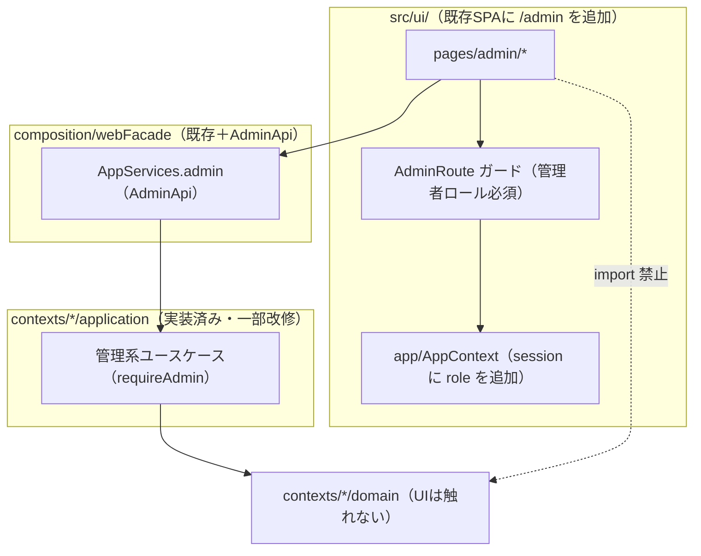
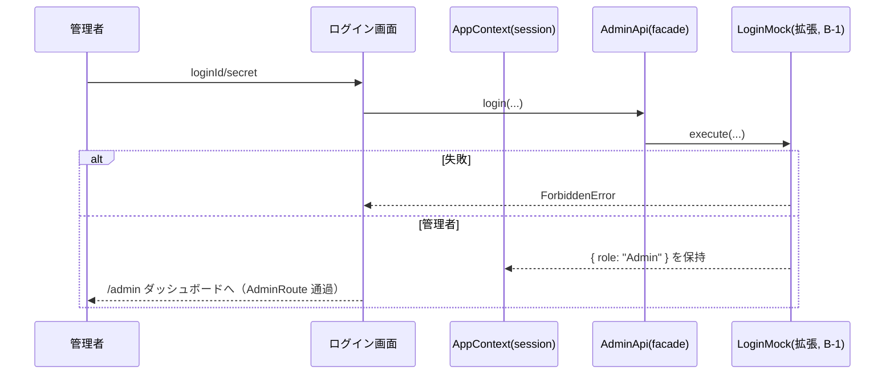
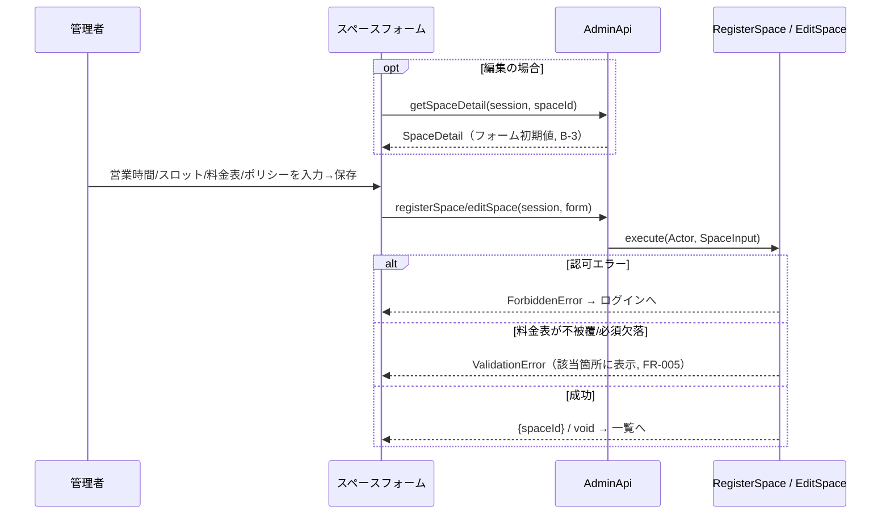
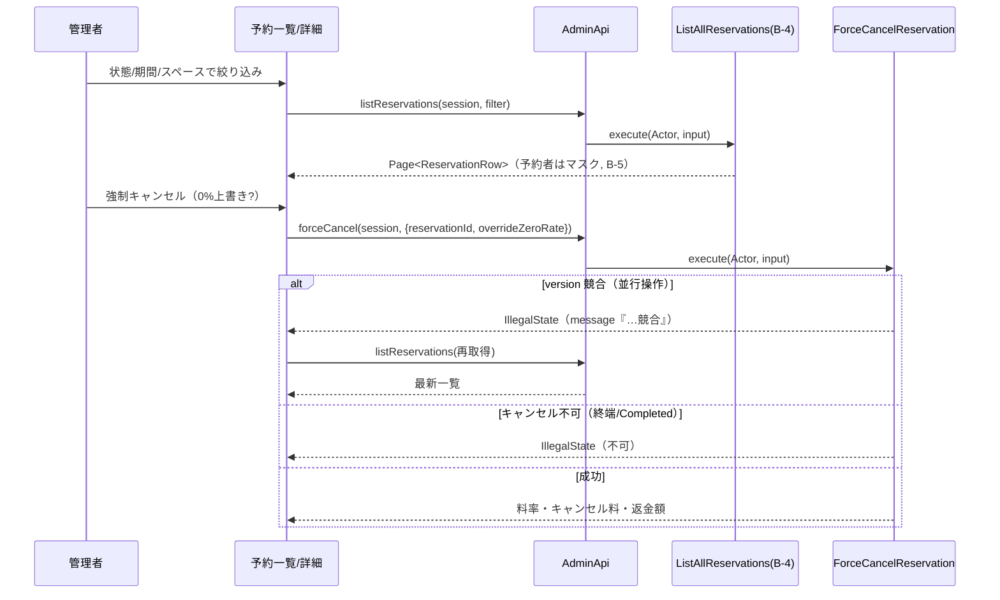
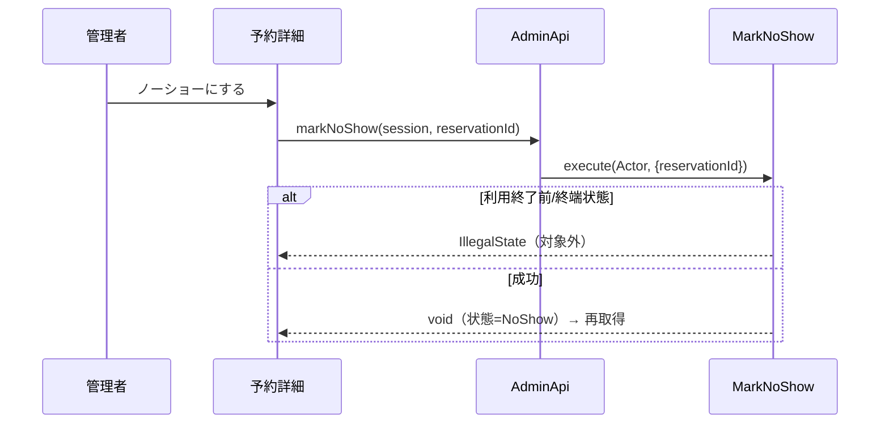

# 設計書: レンタルスペース予約システム 管理者(運営者)UI

| 項目 | 内容 |
|---|---|
| ステータス | Approved |
| 作成日 | 2026-06-25 |
| 承認日 | 2026-06-25 |
| 要件定義書 | docs/requirements/rental-space-booking-admin-ui.md（Approved） |
| 関連 | バックエンド設計: docs/design/rental-space-booking.md（Approved）／フロント(ゲスト)設計: docs/design/rental-space-booking-frontend.md（Approved） |

## 1. 設計概要

管理者 UI は**新規の境界づけられたコンテキストを作らない**。既存の Vite+React SPA に **`/admin/*` ルート**を追加し、実装済みの管理系ユースケース（`RegisterSpace`/`EditSpace`/`SuspendSpace`/`ResumeSpace`/`ListAllReservations`/`ForceCancelReservation`/`MarkNoShow`）を、既存の `webFacade`（composition 層）に**管理者向けサーフェス（AdminApi）**を足して呼ぶ。依存方向はゲスト UI と同一（`ui → composition → application → domain`、NFR-F04）。

設計の要点は6つ:

1. **認可は3段で担保**: (a) `/admin/*` ルートを管理者ロールでガード、(b) facade の管理系メソッドは**セッションのロールから `Actor` を構築して渡す**、(c) 各ユースケースの `requireAdmin` が最終強制（ADR-AD01）。
2. **管理者ログインは `LoginMock` を Admin ロール対応に拡張**し、シードに管理者アカウントを追加（ADR-AD02）。
3. **編集フォームの初期値**には、Space 集約の全設定をプリミティブで返す**読み取りモデル `SpaceDetail`** を新設（ADR-AD03）。
4. **全予約一覧の期間フィルタ**は backend の `ReservationListFilter` を拡張して実現（ADR-AD04）。
5. **管理スペース一覧は公開停止を含む全件**＋ `publishState` を返す（ゲスト用 `ListSpaces` と分離, ADR-AD05）。
6. **予約者 PII はマスク**。`CustomerDirectoryPort.contactOf`（マスク出力）を facade で結合し、平文を UI/ログに出さない（ADR-AD06）。

> これらのうち 2〜5 は**バックエンドの前提改修**（小規模）。本設計はその範囲も定義する（§3）。

## 2. コンテキストマップ（レイヤ依存図）

新規コンテキストは無い。管理者 UI の依存方向を示す（ゲスト UI と同型、`/admin` ガードを追加）。

### コンテキスト間の連携一覧

| 発信元 | 宛先 | 経路 | 内容 |
|---|---|---|---|
| ui(/admin) | composition(AdminApi) | 関数呼び出し（session 同梱） | スペース CRUD・全予約一覧・強制キャンセル・ノーショー・管理者ログイン |
| AdminApi | application | `execute(actor, input)` | facade が session.role から `Actor` を構築して渡す。`requireAdmin` が認可を強制 |
| AdminApi | infrastructure（contactOf） | マスク連絡先の結合 | 一覧の予約者表示用にマスク済み連絡先を解決（平文は持たない） |

## 3. ドメインモデル

### 集約一覧

**新規集約なし。** 既存集約（`Reservation`/`Space`/`Customer`）と管理系ユースケースをそのまま用いる。状態遷移・不変条件は変更しない。

### バックエンド前提改修（管理者 UI を成立させる最小改修）

| # | 改修 | 対象 | 内容 | 対応 |
|---|---|---|---|---|
| B-1 | 管理者ログイン | `customer/application/LoginMock`＋`composition/webFacade`（`SessionUser`/`login`） | 管理者を **Customer としてシード**し（`customerId` を持つ。`LoginMock` は `CustomerRepository` で認証するため）、認証成功時に `{ role: "Admin", customerId }` を返す。`webFacade` の `SessionUser.role` を `"Member" \| "Admin"` に拡張し `login` 実装（現状 `role:"Member"` 固定）を改修 | FR-AD01 |
| B-2 | 管理スペース一覧 | `space/application/ListSpaces`（または新 `ListAllSpaces`） | 公開停止を含む**全件**を返し、`SpaceSummary` に `publishState` を追加 | FR-AD04/AD05 |
| B-3 | 編集用読み取りモデル | `space/application` に新クエリ `GetSpaceDetail`。**`Space` に `ratePlan` getter**（現状欠如）、`RatePlan` に規則読み取り（`toRules()`）、`RateRule` に値読み取りを追加 | Space 集約の全設定（営業時間/スロット/料金表/ポリシー/min-max/horizon/公開状態）を**プリミティブ DTO `SpaceDetail`** で返す。他属性は既存 getter、`cancellationPolicy.tiers` は既存読み取りを利用 | FR-AD02/AD03 |
| B-4 | 一覧の期間フィルタ | `booking/domain/ports/ReservationRepository`（`ReservationListFilter`）＋ `InMemoryReservationRepository.list` ＋ `ListAllReservations`（`ListAllInput`） | `from?`/`to?`(JstDateTime) を追加し、利用開始が範囲内の予約に絞る | FR-AD05 |
| B-5 | （改修なし）マスク連絡先 | `CustomerDirectoryPort.contactOf` | 既存のマスク出力を facade で結合（新規実装不要） | FR-AD05/NFR-AD02 |

> B-1〜B-4 はいずれも小規模。B-3 は `RatePlan.rules`（現在 private）に読み取り getter を足すのみでドメイン不変条件には触れない。B-4 は既存の `status`/`spaceId` フィルタと同じ要領で条件を1つ増やす。

### フロントのビューステート

| state | 保持データ | 備考 |
|---|---|---|
| 管理者セッション | `{ role: "Admin", customerId }` | `AppContext.session` と `webFacade.SessionUser` を `role: "Member" \| "Admin"` に拡張し、`login` 実装も改修（B-1）。メモリ保持・リロード揮発 |
| スペースフォーム | `AdminSpaceFormInput`（登録/編集共通） | 編集時は `GetSpaceDetail` の DTO で初期化 |
| 予約一覧フィルタ | `{ status?, spaceId?, fromDay?, toDay?, page }` | URL クエリと同期可（任意） |

### ドメインイベント

**新規イベントなし。** 強制キャンセルは既存 `ReservationCancelled` を発火（通知へ）。ノーショーはイベントを持たない（終端遷移のみ）。

## 4. DB設計

**新規永続化なし。** 管理者 UI は独自ストレージを持たず、データは既存のインメモリ実装に委譲する（NFR-F03 継承）。B-4 の `ReservationListFilter` への `from`/`to` 追加は**論理的な絞り込み条件の追加**で、インメモリ実装は `list()` の述語に反映する（RDS 化時は `WHERE slot_start_at >= from AND < to` 相当）。新規テーブル・インデックスは不要。

## 5. API設計（UI が消費する AdminApi 契約）

HTTP API は持たない（in-process）。`webFacade` に管理者サーフェス `AppServices.admin: AdminApi` を追加する。各メソッドは**呼び出し元のセッションを受け取り**、facade 内で `Actor` を構築して `requireAdmin` 付きユースケースへ渡す（プリミティブ／DTO のみ授受）。

| 画面/操作 | AdminApi メソッド | 入力 → 出力 | 要件 |
|---|---|---|---|
| 管理者ログイン | `login`(既存拡張) | (loginId, secret) → `SessionUser{role}` / Forbidden | FR-AD01 |
| スペース一覧（停止含む） | `admin.listSpaces` | (session) → `SpaceSummary[]`（`publishState` 付） | FR-AD04 |
| スペース詳細（編集初期値） | `admin.getSpaceDetail` | (session, spaceId) → `SpaceDetail` / NotFound | FR-AD03 |
| スペース登録 | `admin.registerSpace` | (session, `AdminSpaceFormInput`) → {spaceId} / Validation/Forbidden | FR-AD02 |
| スペース編集 | `admin.editSpace` | (session, spaceId, `AdminSpaceFormInput`) → void / Validation/NotFound/Forbidden | FR-AD03 |
| 公開停止 / 再開 | `admin.suspendSpace` / `admin.resumeSpace` | (session, spaceId) → void / Forbidden | FR-AD04 |
| 全予約一覧 | `admin.listReservations` | (session, {status?, spaceId?, fromDay?, toDay?, page?, size?}) → `Page<ReservationRow>` / Forbidden | FR-AD05 |
| 強制キャンセル | `admin.forceCancel` | (session, {reservationId, overrideZeroRate?}) → `CancellationResult` / IllegalState/PaymentFailed/NotFound/Forbidden（version競合も IllegalState） | FR-AD06 |
| ノーショー判定 | `admin.markNoShow` | (session, reservationId) → void / IllegalState/NotFound/Forbidden（version競合も IllegalState） | FR-AD07 |

> `ReservationRow` = `ReservationView` ＋ `maskedRecipient`（B-5 で facade が結合）。`AdminSpaceFormInput` は backend の `SpaceInput`（既にプリミティブ）に対応。`SpaceDetail` = `AdminSpaceFormInput` ＋ `spaceId` ＋ `publishState`。

### エラーレスポンス規約（表示マッピング）

ゲスト UI（フロント設計書 §5）と同一規約。管理者 UI で頻出のものを補足:

| kind | 提示場所 | 次アクション |
|---|---|---|
| `ForbiddenError` | 全体バナー | 管理者ログインへ誘導（セッション失効時, FR-AD01） |
| `ValidationError` | フォーム直下（`details[]` 列挙） | 入力修正（料金表不被覆等, FR-AD02/03） |
| `IllegalState` | 行/詳細バナー | 操作不可提示（終端/Completed でキャンセル・ノーショー不可）。**version 競合（並行操作）も `IllegalState`（message『…競合』）で表面化**するため message で判別し対象・一覧を再取得（FR-AD06/07/08） |
| `PaymentFailed` | バナー | 返金（モック）失敗。決済挙動が Fail/Timeout のとき強制キャンセルの返金で発生し得る。やり直しを促す（FR-AD06） |
| `NotFound` | 行/バナー | 一覧へ戻る |

> **注（競合エラーの実態）**: 占有競合専用の `ConflictError` は予約作成(place)でのみ発生し、管理操作では返らない。集約の状態遷移競合（楽観ロック version）は `IllegalState`(message『…競合』) として返るため、UI は message で競合を判別して再取得する。将来、競合専用エラー型を新設すれば message 判定は不要になる。

### ページネーション方針

`admin.listReservations` は backend の `ListAllReservations` に従い**オフセット方式**（`page`/`size`、既定 size=20・上限100）。UI は前後ページ移動と総件数表示。カーソル方式は将来拡張。

## 6. 主要シーケンス

### 6-1. 管理者ログイン → ダッシュボード（FR-AD01）

### 6-2. スペース登録/編集（被覆検証）（FR-AD02/AD03）

### 6-3. 全予約一覧 → 強制キャンセル（version 競合再取得）（FR-AD05/AD06/AD08）

### 6-4. ノーショー判定（FR-AD07）

## 7. ADR（設計判断の記録）

### ADR-AD01: 認可は「ルートガード＋セッションロールを facade に渡し requireAdmin で強制」

- **ステータス**: Accepted
- **コンテキスト**: FR-AD01/FR-042, NFR-AD01。管理機能を非管理者から保護したい。
- **決定**: (a) `/admin/*` を `AdminRoute` でガード、(b) AdminApi 各メソッドは UI セッションを受け取り `Actor{role}` を構築、(c) ユースケースの `requireAdmin` が最終強制。3段で多重防御。
- **検討した代替案**: facade が常に `Actor{role:"Admin"}` を内部生成 → `requireAdmin` が常に通り認可が形骸化。
- **トレードオフ**: セッションロールは UI 由来でサーバ検証がない（ADR-F02 と同じデモ簡略化）。なりすまし防止は本デモ範囲外。`requireAdmin` を残すことで本番化時の認可境界は維持。

### ADR-AD02: 管理者ログインは `LoginMock` を Admin 対応に拡張

- **ステータス**: Accepted
- **コンテキスト**: FR-AD01。現状 `LoginMock` は Member ロールのみ発行。
- **決定**: 管理者アカウントを **Customer としてシード**し（`customerId` を持つ。`LoginMock` は `CustomerRepository` 経由で認証するため）、`LoginMock` が認証成功時に `{ role: "Admin", customerId }` を返す。`webFacade` の `SessionUser.role` を `"Member" \| "Admin"` に拡張し、現状 `role:"Member"` 固定の `login` 実装を改修。
- **検討した代替案**: 専用 `LoginAdmin` ユースケース新設 → 認証経路が二重化、テストも増。既存ポートに一貫させ最小化。
- **トレードオフ**: `LoginMock` がロール分岐を持つ。モック認証の範囲では軽微。

### ADR-AD03: 編集フォーム用に読み取りモデル `SpaceDetail` を新設

- **ステータス**: Accepted
- **コンテキスト**: FR-AD03。編集フォームは Space の全設定（料金表・営業時間・ポリシー等）を初期表示する必要があるが、既存 `SpaceSummary` は一部しか持たず、`RatePlan.rules` は private。
- **決定**: `space/application` に `GetSpaceDetail` を新設し、全設定を**プリミティブ DTO**で返す。`RatePlan` に規則読み取り getter（`toRules()`）を追加（不変条件は不変）。`CancellationPolicy.tiers` は既存の読み取りを利用。
- **検討した代替案**: Space 集約を UI へ渡す → NFR-F04（UI はドメイン非依存）違反。`SpaceSummary` を肥大化 → 一覧用途と編集用途が混線。
- **トレードオフ**: 読み取り getter とクエリが増える。境界の純粋性（プリミティブ越境）を優先。

### ADR-AD04: 全予約一覧の期間フィルタは backend を拡張して実現

- **ステータス**: Accepted
- **コンテキスト**: FR-AD05。要件は状態＋**期間**＋スペースの絞り込みだが、`ReservationListFilter` は `status`/`spaceId` のみ。
- **決定**: `ReservationListFilter` に `from?`/`to?`(JstDateTime) を追加し、`InMemoryReservationRepository.list` と `ListAllInput` を拡張。利用開始が範囲内の予約に絞る。
- **検討した代替案**: クライアント側で期間フィルタ → オフセットページングと両立せず（ページ跨ぎで件数・絞り込みが不整合）。却下。
- **トレードオフ**: ドメインポート型に条件が1つ増える。既存の `status`/`spaceId` と同じ要領で最小拡張。

### ADR-AD05: 管理スペース一覧は公開停止含む全件＋ publishState

- **ステータス**: Accepted
- **コンテキスト**: FR-AD04。管理者は公開停止スペースも一覧・再開する必要がある。ゲスト用 `ListSpaces` は公開中のみ。
- **決定**: 管理用に**全件＋ `publishState`** を返す経路を用意（`ListSpaces` に `includeSuspended` パラメータ追加、または `ListAllSpaces` 新設）。`SpaceSummary` に `publishState` を追加。
- **検討した代替案**: ゲスト用 `ListSpaces` をそのまま使う → 停止スペースが見えず再開不能。
- **トレードオフ**: スペース一覧の経路が用途別に分岐。ゲスト/管理の関心分離としては妥当。

### ADR-AD06: 予約者 PII はマスク（`contactOf` を facade で結合）

- **ステータス**: Accepted
- **コンテキスト**: FR-AD05, NFR-AD02/NFR-002。一覧で予約者を識別したいが PII 平文は出せない。
- **決定**: `ReservationView`（`customerId` のみ保持）に対し、facade が `CustomerDirectoryPort.contactOf`（マスク出力）で結合し `maskedRecipient` を付与（`ReservationRow`）。平文連絡先は UI/ログに出さない。
- **検討した代替案**: 一覧 DTO に平文連絡先を載せる → NFR-002 違反。
- **トレードオフ**: 一覧生成時に顧客解決の結合が増える（小規模デモでは無視できる）。

## 8. 要件トレーサビリティ

| 要件ID | 対応する設計項目 | 備考 |
|---|---|---|
| FR-AD01 | §6-1, B-1, ADR-AD01/AD02, AdminRoute | ログイン＋認可ガード |
| FR-AD02 | §6-2, §5 registerSpace, FR-005 被覆検証 | 新規登録 |
| FR-AD03 | §6-2, B-3 SpaceDetail/getSpaceDetail, ADR-AD03 | フル編集・初期値 |
| FR-AD04 | §5 suspend/resume・admin.listSpaces, B-2, ADR-AD05 | 公開停止/再開・全件一覧 |
| FR-AD05 | §6-3, B-4 期間フィルタ, ADR-AD04, B-5 マスク | 一覧・絞り込み・ページング |
| FR-AD06 | §6-3 forceCancel（overrideZeroRate） | 強制キャンセル・0%上書き |
| FR-AD07 | §6-4 markNoShow | ノーショー |
| FR-AD08 | §6-3 競合分岐, §5 エラー規約(IllegalState/競合message) | version 競合は `IllegalState` で表面化し message 判別→再取得 |
| FR-AD09 | §5 エラーマッピング | 型付きエラー日本語化 |
| NFR-AD01 | ADR-AD01, AdminRoute, requireAdmin | 認可多重防御 |
| NFR-AD02 | ADR-AD06, B-5 | PII マスク |
| NFR-AD03 | §5 オフセットページング | 体感即時 |
| NFR-AD04 | §2 依存図, AdminApi(facade) | UI→domain 非依存 |
| NFR-AD05 | （既存）2パス tsconfig | 型チェック |
| NFR-AD06 | §5 エラー規約・既存UI規約踏襲 | 一貫性 |

## 9. 未解決事項

| # | 論点 | 対応方針 |
|---|---|---|
| D-AD01 | 料金表編集 UI の操作（行追加/削除・曜日×時間帯の表現・被覆プレビュー） | 実装時に確定。最も実装量が大きい。被覆不足は保存時の `ValidationError` で担保しつつ、可能なら入力中に簡易チェック |
| D-AD02 | スペース一覧の全件取得経路（`ListSpaces` 拡張 vs `ListAllSpaces` 新設） | 実装時に確定（ADR-AD05 の範囲内） |
| D-AD03 | 管理者アカウントのシード内容（loginId/secret） | 実装時に確定。デモ用固定1件（P-A07） |

## 10. 変更履歴

| 日付 | 変更内容 | 変更者 |
|---|---|---|
| 2026-06-25 | 初版作成。管理者 UI を `/admin` 拡張として設計。認可3段（ルートガード＋セッションロール＋requireAdmin）、`LoginMock` Admin 拡張、`SpaceDetail` 読み取りモデル、一覧の期間フィルタ拡張、全件スペース一覧、PII マスク結合（ADR-AD01〜AD06）。バックエンド前提改修 B-1〜B-5 を定義 | Claude |
| 2026-06-25 | サブエージェント評価を反映: version競合は `IllegalState`（`ConflictError`は占有専用）と訂正、`forceCancel` に `PaymentFailed`（返金失敗）追加、B-3 に `Space.ratePlan` getter 追加を明記、B-1/ADR-AD02 で管理者を Customer としてシード（customerId 保持）・`webFacade.login` 改修を明記 | Claude |
