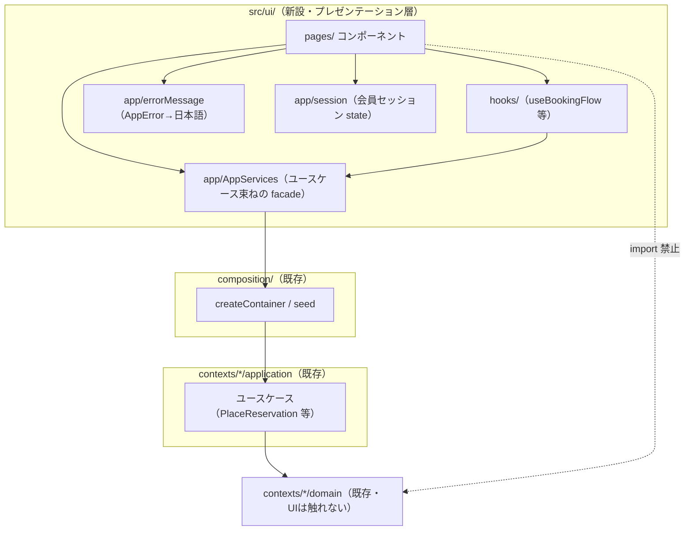
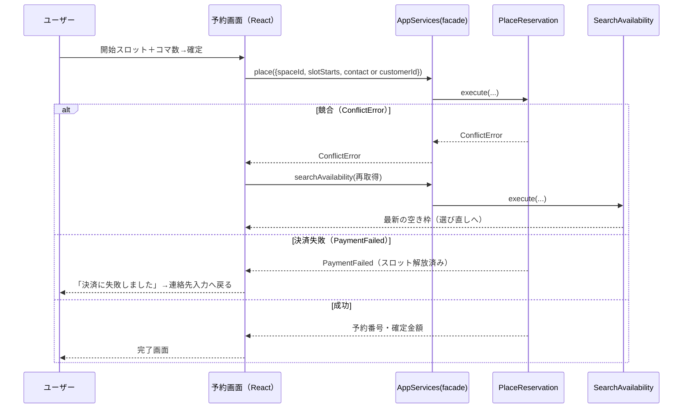
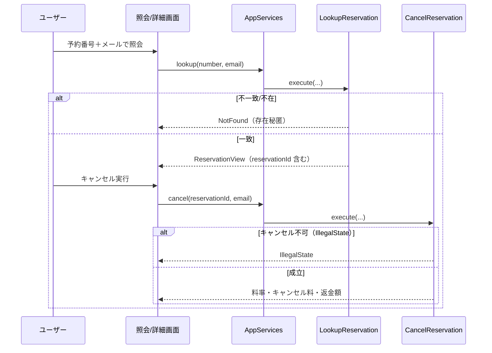
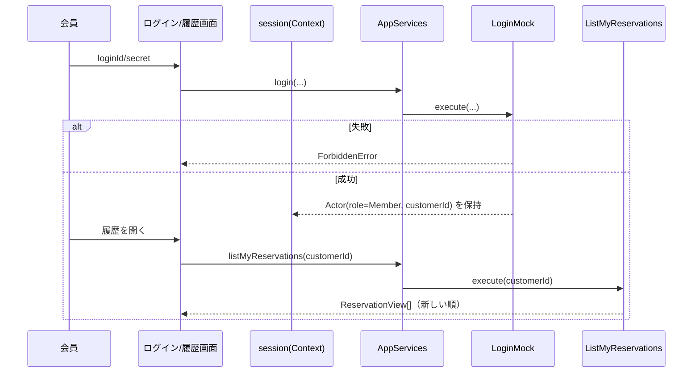
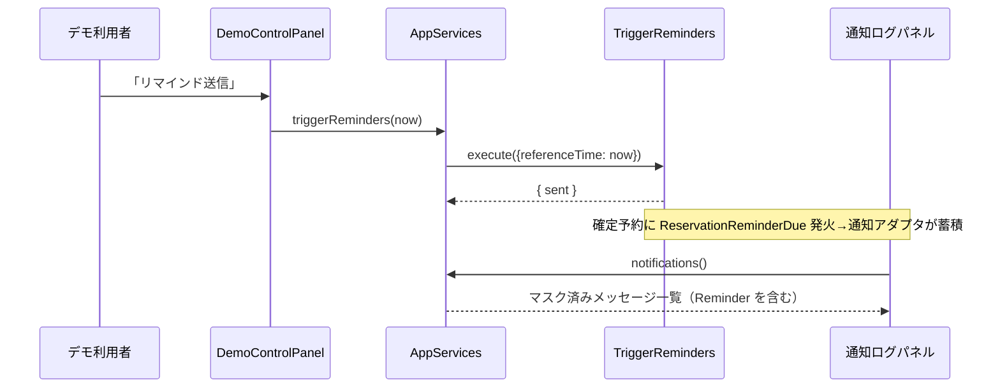

# 設計書: レンタルスペース予約システム フロントエンド（ゲスト予約フロー）

| 項目 | 内容 |
|---|---|
| ステータス | Approved |
| 作成日 | 2026-06-24 |
| 承認日 | 2026-06-25 |
| 要件定義書 | docs/requirements/rental-space-booking-frontend.md（Approved） |
| 関連 | バックエンド設計: docs/design/rental-space-booking.md（Approved, 実装済み） |

## 1. 設計概要

フロントは**新規の境界づけられたコンテキストを作らない**。既存のバックエンド（予約コア・スペース・利用者・決済/通知モック）の**プレゼンテーション層**として `src/ui/` に React SPA を新設し、合成ルート `composition/createContainer()` が返すアプリケーションサービス（ユースケース）をブラウザ内から直接呼ぶ（HTTP サーバなし）。

主要な技術判断は5つ:

1. **依存は一方向 `ui → composition → application → domain`**。UI はドメイン層を一切 import せず、ユースケースの `Result<T,E>` を受け取り表示にマッピングする（NFR-F04）。
2. **アプリ層への到達は React Context で1点に集約**（`AppServicesProvider`）。コンポーネントは `useAppServices()` 経由でユースケースを呼び、コンテナの生成・配線を知らない。
3. **会員予約は `customerId` で厳密に紐づける**。そのため `PlaceReservation` に任意の `customerId` を受け取る**小改修**を行う（ゲスト経路は不変）。これが唯一のバックエンド・ドメイン隣接変更。
4. **永続化は持たない**。状態はバックエンドのインメモリ実装に委譲し、ブラウザリロードで揮発（NFR-F03）。コンテナはページロードごとに1インスタンス生成＋シード初期化。
5. **Vite + React + TypeScript(strict)** を既存リポジトリに統合。型チェックは backend/ui を tsconfig 分割（軽量2パス）し、ドメイン/バックエンドへの DOM・React 混入をコンパイラで弾く（ADR-F05）。

## 2. コンテキストマップ（レイヤ依存図）

新規コンテキストは無いため、ここでは**フロントの依存方向**を示す。矢印はコンパイル時依存（import）の向き。



### コンテキスト間の連携一覧

| 発信元 | 宛先 | 経路 | 内容 |
|---|---|---|---|
| ui | composition | 関数呼び出し（`createContainer`） | アプリ起動時に1度だけコンテナ生成・シード実行。以降は facade 経由でユースケースを呼ぶ |
| ui (facade) | application | ユースケースの `execute()` | 検索・見積・予約・キャンセル・照会・履歴・会員登録/ログイン・リマインド |
| ui (facade) | infrastructure（mock adapters） | デモ操作のみ | 通知ログ取得（`notifier.sent()`）・決済挙動切替（`payment.setBehavior`）。デモ用の限定的アクセス（ADR-F04） |
| ui | domain | （なし） | UI からドメイン層への import は禁止（NFR-F04, ESLint/grep で担保） |

## 3. ドメインモデル

### 集約一覧

**新規集約なし。** フロントは状態を持つ集約を導入せず、既存のドメインモデル（`Reservation`/`Space`/`Customer` 等, バックエンド設計書 §3）をそのまま利用する。

唯一のドメイン隣接変更は、**コアドメインのユースケース `PlaceReservation` の入力契約の拡張**（集約の不変条件・状態遷移は不変）。

#### 変更: `PlaceReservation` 入力に `customerId` を追加（FR-F07/F08, U-F01）

```ts
export type PlaceReservationInput = {
  readonly spaceId: SpaceId;
  readonly slotStarts: readonly JstDateTime[];
  readonly contact?: GuestContactInput;   // ゲスト経路で必須
  readonly customerId?: CustomerId;        // 会員経路で指定（指定時は contact 不要）
  readonly paymentToken?: string;          // 保存しない（NFR-002）
};
```

顧客解決ロジック（`PlaceReservation.execute` 冒頭）:

1. `input.customerId` が指定されている → `CustomerDirectoryPort.contactOf(customerId)` で存在検証。存在しなければ `ValidationError`。存在すればその `customerId` を使用（`resolveOrIssueGuest` は呼ばない）。
2. それ以外で `input.contact` が指定 → 従来どおり `resolveOrIssueGuest(contact)` でゲスト顧客を発行。
3. どちらも無い → `ValidationError("予約者情報がありません")`。

ゲスト経路（2）は完全に従来互換。会員経路（1）でのみ新パスを通す。`Reservation` 集約・占有一意性・決済 Saga は一切変更しない。

> **権限の前提（デモ簡略化）**: `customerId` はブラウザ内の会員セッション（`LoginMock` の結果）由来であり、サーバ側認証で検証しない。なりすまし防止は本デモのスコープ外（ADR-F02 のトレードオフ）。

#### 追加: `ListSpaces` クエリ（FR-F01）

スペース一覧表示のため、`space/application` に読み取り専用クエリ `ListSpaces` を新設し、UI がリポジトリを直接触らずに済むようにする（NFR-F04）。公開中（Published）のスペースのみ返す。

```ts
export type SpaceSummary = {
  readonly spaceId: string;
  readonly name: string;
  readonly capacity: number;
  readonly businessHours: string;   // 例 "09:00–18:00"
  readonly slotMinutes: number;     // スロット選択UIのコマ計算に使用
  readonly minSlots: number;
  readonly maxSlots: number;
};
// ListSpaces.execute(): SpaceSummary[]  （Published のみ）
```

### フロントのビューステート（UI 状態モデル）

予約ウィザードの状態は `useReducer`（`hooks/useBookingFlow.ts`）で管理する。永続化しない（NFR-F03）。状態列挙は §6・要件 §7 の画面遷移に対応。

| state | 保持データ | 主な遷移先 |
|---|---|---|
| `selectingSpace` | spaces 一覧 | `viewingAvailability` |
| `viewingAvailability` | spaceId, 期間, 空きスロット（日別） | `selectingSlots` |
| `selectingSlots` | 開始スロット, コマ数, 見積もり(Money) | `enteringContact` |
| `enteringContact` | 連絡先 or 会員セッション | `placing` |
| `placing` | 実行中 | `completed` / `enteringContact`(決済失敗) / `viewingAvailability`(競合) |
| `completed` | 予約番号・確定金額 | 終了 |

### ドメインイベント

**新規イベントなし。** 既存の `ReservationConfirmed`/`ReservationCancelled`/`ReservationReminderDue` を通知アダプタが購読し、UI は `MockNotificationAdapter` が蓄積したメッセージをポーリング表示する（FR-F10）。

## 4. DB設計

**該当なし（新規永続化を持たないため）。** フロントは独自の DB・ストレージを持たず、データは全てバックエンドのインメモリ実装（`InMemory*Repository`）に委譲する。ブラウザリロードでデータは揮発し、起動時シードで初期化する（NFR-F03, P-F02）。localStorage 等の永続化は本イテレーションのスコープ外。

## 5. API設計（UI が消費するアプリケーションサービス契約）

HTTP API は持たない（in-process 呼び出し）。一次的な「API」は**ユースケースの契約**であり、UI 画面との対応を以下に示す。

### 画面 ↔ ユースケース対応

| 画面 / 操作 | 呼ぶユースケース | 入力 → 出力 | 要件ID |
|---|---|---|---|
| スペース一覧 | `ListSpaces`(新) | () → SpaceSummary[] | FR-F01 |
| 空き枠照会 | `SearchAvailability` | (spaceId, fromDay, toDay) → 空きスロット[] | FR-F02 |
| 見積もり | `QuoteReservation` | (spaceId, slotStarts) → Money | FR-F03 |
| 予約確定（ゲスト） | `PlaceReservation` | (spaceId, slotStarts, contact) → 予約番号 / Conflict/Payment/Validation | FR-F04/F05 |
| 予約確定（会員） | `PlaceReservation`(改) | (spaceId, slotStarts, customerId) → 予約番号 | FR-F07 |
| 予約照会 | `LookupReservation` | (予約番号, email) → ReservationView / NotFound | FR-F06 |
| キャンセル | `CancelReservation` | (reservationId, email) → 料率/料/返金 | FR-F07 |
| 会員登録 | `RegisterMember` | (氏名,email,電話,loginId,secret) → customerId | FR-F08 |
| ログイン | `LoginMock` | (loginId, secret) → Actor(role,customerId) / Forbidden | FR-F08 |
| 予約履歴 | `ListMyReservations` | (memberId) → ReservationView[] | FR-F09 |
| 通知ログ | facade `notifications()` | () → NotificationMessage[]（マスク済み） | FR-F10 |
| 決済挙動切替 | facade `setPaymentBehavior()` | (Succeed/Fail/Timeout) → void | FR-F11 |
| リマインド送信 | `TriggerReminders` | (referenceTime=now) → { sent } | FR-F11 |

### エラーレスポンス規約（表示マッピング）

バックエンドの型付きエラー（`AppError` 判別可能ユニオン）を、`app/errorMessage.ts` で表示に変換する。原則として `error.message`（日本語）をそのまま表示し、`kind` で**提示場所と次アクション**を決める（FR-F12）。

| kind | 提示場所 | 次アクション |
|---|---|---|
| `ValidationError` | 該当フォーム直下（`details[]` を列挙） | 入力修正。画面遷移しない |
| `ConflictError` | バナー＋空き枠自動再取得 | スロット選び直し（`viewingAvailability` へ, FR-F05） |
| `PaymentFailed` | 確認画面のバナー | やり直し（`enteringContact` へ。スロットは解放済み） |
| `NotFound` | 照会フォーム直下 | 入力確認（存在は秘匿） |
| `ForbiddenError` | ログイン画面のバナー | 再ログイン |
| `IllegalState` | 詳細画面のバナー | 操作不可を提示（例: キャンセル不可） |

> UI は全 `kind` を網羅的に分岐し、未知エラーでも汎用フォールバック表示で画面を壊さない（NFR-F05）。

### ページネーション方針

`ListMyReservations` はデモ規模（NFR-F01）のため**全件取得しクライアント側表示**（ページングなし）。管理者の `ListAllReservations`（オフセット方式）は本フロントのスコープ外。

## 6. 主要シーケンス

### 6-1. 予約作成（会員/ゲスト・競合再取得・決済失敗）— FR-F03/F04/F05/F07



会員経路は `place()` に `customerId`（セッション由来）を渡す点のみ異なり、`PlaceReservation` 内で `contactOf` 存在検証→直接紐づけ（§3）。

### 6-2. 照会 → キャンセル — FR-F06/F07



### 6-3. ログイン → 履歴 — FR-F08/F09



### 6-4. リマインド送信（デモ操作）— FR-F11/F10



## 7. ADR（設計判断の記録）

### ADR-F01: ブラウザ内でアプリ層を直接呼ぶ（HTTP サーバを置かない）

- **ステータス**: Accepted
- **コンテキスト**: 要件 P-F01/構成選択。バックエンドは純TSのインメモリ実装でブラウザでも動作する。
- **決定**: HTTP API 層・サーバを設けず、SPA が `createContainer()` のユースケースを in-process で呼ぶ。
- **検討した代替案**: (a) Express 等でREST化しfetch経由 → サーバ起動・CORS・DTOシリアライズ・エラー往復の実装が増え、デモには過剰。(b) Next.js のサーバ機能 → スタック肥大。
- **トレードオフ**: 本番のネットワーク境界・認証境界を再現しない（なりすまし検証不可, ADR-F02）。将来 RDS/サーバ化する際は facade の裏を HTTP クライアントに差し替える前提とし、UI は変更不要にする。

### ADR-F02: 会員紐づけは `PlaceReservation` に `customerId` を追加して厳密化

- **ステータス**: Accepted
- **コンテキスト**: FR-F07/U-F01。会員予約を履歴へ確実に紐づけたい。
- **決定**: `PlaceReservation` 入力に任意の `customerId` を追加。指定時は存在検証のうえ直接紐づけ、ゲストは従来どおり `resolveOrIssueGuest`。
- **検討した代替案**: (a) 連絡先メール一致で顧客解決（改修不要）→ メール書き換えで別顧客に逸れる・会員と同一メールのゲスト予約が混線。(b) `Actor` を丸ごと渡す → ドメイン隣接ユースケースに認可概念が混入。最小の `customerId` 追加に留めた。
- **トレードオフ**: `customerId` はブラウザセッション由来で**サーバ側認証検証がない**（なりすまし可能）。デモ範囲では許容。本番化時は認証済み Actor から導出する。

### ADR-F03: アプリ層への到達を React Context（AppServices facade）に集約

- **ステータス**: Accepted
- **コンテキスト**: NFR-F04/F05。UI からドメイン層 import を防ぎ、ユースケース呼び出しを一元化したい。
- **決定**: 起動時にコンテナを1度生成し、ユースケースを束ねた `AppServices` を Context で供給。コンポーネントは `useAppServices()` のみ使用。
- **検討した代替案**: (a) 各コンポーネントで `createContainer()` → 複数コンテナ＝状態分裂（インメモリが別々）。(b) グローバル変数 → テスト容易性・差し替え性が低い。
- **トレードオフ**: Context の単一性に依存。テストでは Provider にモック facade を差し込む。

### ADR-F04: デモ操作（通知ログ閲覧・決済切替）はモックアダプタへ限定アクセス

- **ステータス**: Accepted
- **コンテキスト**: FR-F10/F11, NFR-004。モックの結果可視化・挙動切替が要件。
- **決定**: `notifier.sent()` / `payment.setBehavior()` を `AppServices` facade のデモ用メソッドとして公開し、コンポーネントは facade 経由でのみ触る。
- **検討した代替案**: 専用の application サービスを新設 → デモ専用機能に集約を作るのは過剰。
- **トレードオフ**: facade が一部インフラ（mock adapter）に依存する。デモ専用と明記し、本番化時は除去/差し替え対象とする。

### ADR-F05: Vite 統合と tsconfig 分割（軽量2パス）

- **ステータス**: Accepted
- **コンテキスト**: NFR-F04/F06。バックエンドは意図的に DOM 無し（`lib: ES2023`, `types: node`）で、ドメイン層がブラウザAPIに依存しないことを**コンパイラで強制**している。フロントには DOM/JSX が必要だが、この境界は維持したい。
- **決定**: tsconfig を backend/ui に分割し、型チェックを2パスで回す（軽量構成、project references は使わない）。
  - `tsconfig.json`（backend）: 既存設定を維持し、`exclude` に `src/ui` を追加。DOM 無しで全バックエンドを型チェックする。
  - `tsconfig.ui.json`: `tsconfig.json` を `extends` し、`lib` に `DOM`/`DOM.Iterable` を追加、`jsx: "react-jsx"`、`include: ["src/ui"]`、`exclude: ["node_modules","dist"]`（親の `src/ui` 除外を上書き）。
  - `npm run typecheck` = backend パス + ui パス（`tsc -p tsconfig.json --noEmit && tsc -p tsconfig.ui.json --noEmit`）。
  - Vite + `@vitejs/plugin-react` を追加し `dev`(vite) / `build:web`(vite build)。既存の `test`/`build`(tsc) は維持。
  - **境界保証**: backend パスが `src/ui` を除外し DOM 無しで検査するため、ドメイン/バックエンドへの DOM・React 混入はコンパイルエラーになる（NFR-F04）。
- **検討した代替案**: (a) 単一 tsconfig に DOM/JSX を全体追加 → 設定は最小だが、ドメインの DOM 非依存をコンパイラで保証できなくなり、本プロジェクトの主旨（厳格な依存境界）に反する。(b) project references（`tsc -b`, 各 config に `composite:true`）→ エディタの型解決は最も正確だが composite 等の設定が重く、学習リポジトリには過剰。
- **トレードオフ**: typecheck が2パスになる（実行時間の微増・共有ファイルの二重検査）。ui パスは import したバックエンドファイルを DOM lib 下でも検査するが、同ファイルは backend パスでも DOM 無しで検査されるため、境界の最終保証は backend パスが担う。

### ADR-F06: ルーティングは react-router-dom、状態は React 標準

- **ステータス**: Accepted
- **コンテキスト**: 複数画面（予約導線・照会・会員・履歴）。
- **決定**: `react-router-dom` でルート分割。グローバル状態は Context（AppServices・session）、予約ウィザードは `useReducer`。外部状態管理ライブラリは導入しない。
- **検討した代替案**: (a) 自前のビューステート切替 → ルート/戻る/ブックマークが弱い。(b) Redux/Zustand → デモには過剰。
- **トレードオフ**: ルータ依存が1つ増える。デモ規模では妥当。

## 8. 要件トレーサビリティ

| 要件ID | 対応する設計項目 | 備考 |
|---|---|---|
| FR-F01 | §3 `ListSpaces`(新), §5 一覧, SpaceListPage | 公開中のみ |
| FR-F02 | §5 `SearchAvailability`, AvailabilityPage | 期間・日別表示 |
| FR-F03 | §5 `QuoteReservation`, §3 ビューステート, SlotPicker | 開始＋コマ数 |
| FR-F04 | §6-1, §5 `PlaceReservation`, BookingConfirmPage | ゲスト経路 |
| FR-F05 | §5 エラー規約(Conflict), §6-1 再取得 | 競合自動再取得 |
| FR-F06 | §6-2 `LookupReservation` | 存在秘匿 NotFound |
| FR-F07 | §3 `PlaceReservation`改/§6-2 `CancelReservation` | customerId 紐づけ・キャンセル |
| FR-F08 | §6-3 `RegisterMember`/`LoginMock`, session | モック認証 |
| FR-F09 | §6-3 `ListMyReservations` | 全件・新しい順 |
| FR-F10 | §2 facade `notifications()`, NotificationLogPanel | マスク表示 |
| FR-F11 | §6-4 `TriggerReminders`/`setPaymentBehavior`, DemoControlPanel | デモ操作 |
| FR-F12 | §5 エラー表示マッピング, errorMessage.ts | 全 kind 網羅 |
| NFR-F01 | §4（インメモリ委譲）, §5 全件取得 | 体感即時 |
| NFR-F02 | §2 facade（マスク済み通知）, §3 paymentToken 非保存 | PII/決済情報を残さない |
| NFR-F03 | §4 永続化なし, §1 起動時シード | 揮発許容 |
| NFR-F04 | §2 依存図, ADR-F03 | UI→domain import 禁止 |
| NFR-F05 | §5 エラー規約, ADR-F03 | 全エラー分岐 |
| NFR-F06 | ADR-F05/F06 | Vite+React+strict |

## 9. 未解決事項

| # | 論点 | 対応方針 |
|---|---|---|
| D-F01 | スタイリング | 独自最小 CSS（CSS Modules もしくは単一 stylesheet）で実装。UI ライブラリは導入しない（要件 U-F02 を踏襲）。 |
| D-F02 | シードの具体内容 | 実装時に確定。最低2スペース（例: 会議室A=平日1000/土日2000、スタジオB=別営業時間・別単価）＋デモ会員1名（taro）。`composition/seed.ts` を拡張。 |
| D-F03 | UI のテスト方針 | ロジック（errorMessage・useBookingFlow reducer・facade）はユニットテスト。コンポーネントの結合テストは最小限（デモ前提）。E2E は対象外。 |

## 10. 変更履歴

| 日付 | 変更内容 | 変更者 |
|---|---|---|
| 2026-06-24 | 初版作成。フロントを既存コンテキスト上のプレゼンテーション層として設計。`ui→composition→application→domain` の一方向依存、AppServices facade、`PlaceReservation` の customerId 小改修、`ListSpaces` 新設、Vite 統合（ADR-F01〜F06）を定義 | Claude |
| 2026-06-25 | レビュー反映。ADR-F05 を「tsconfig 分割（軽量2パス）」に改訂し、ドメインの DOM 非依存をコンパイラで保証する構成に変更。Approved 化 | Claude |
