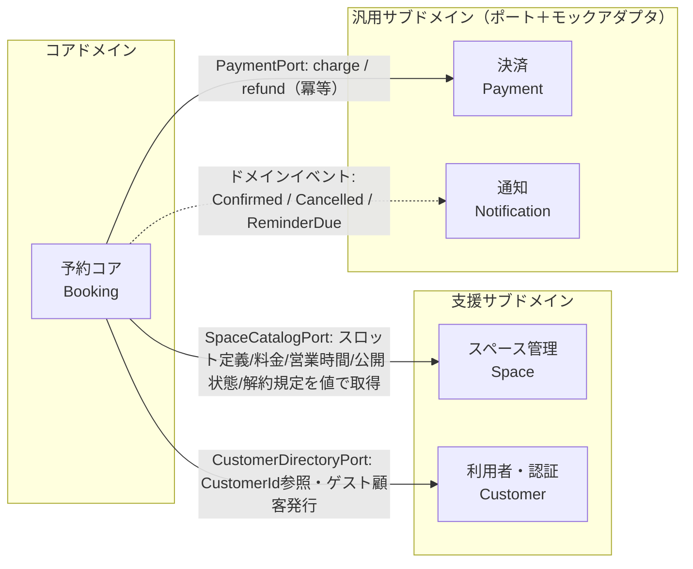
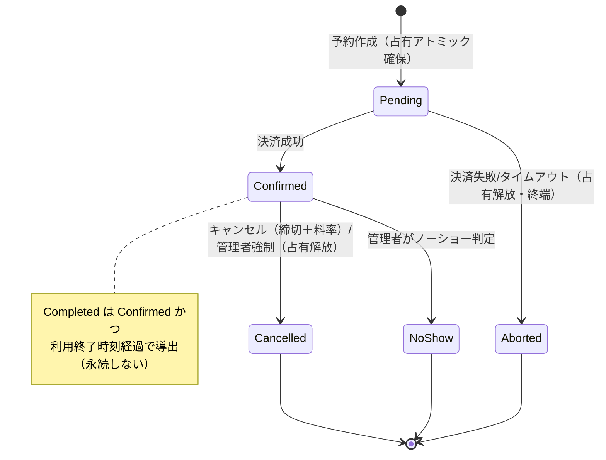
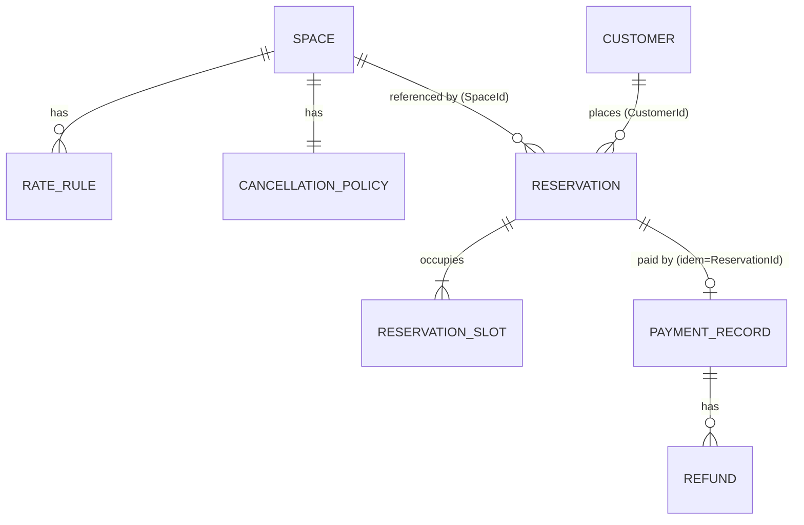
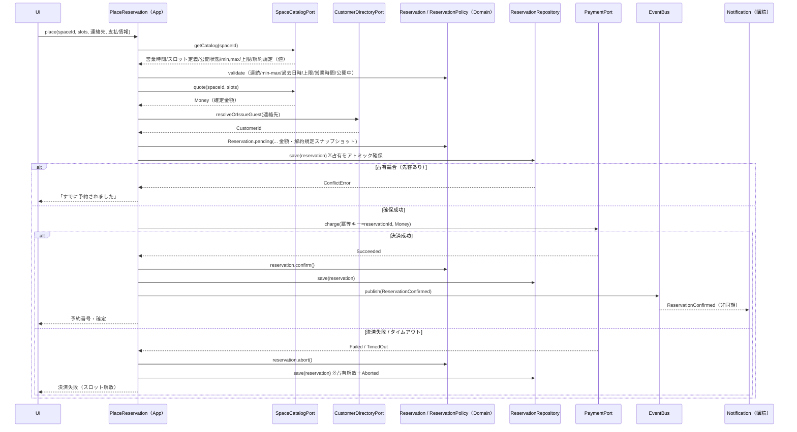
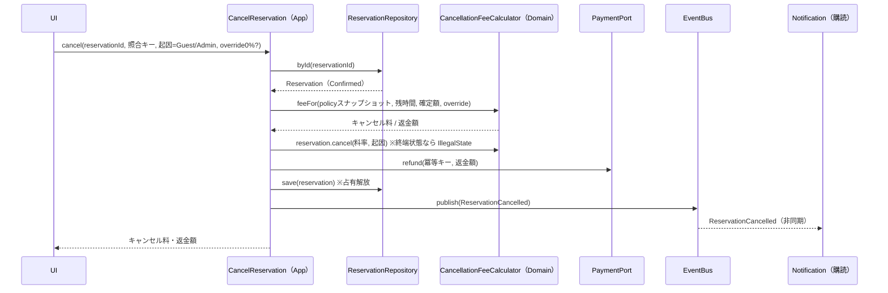
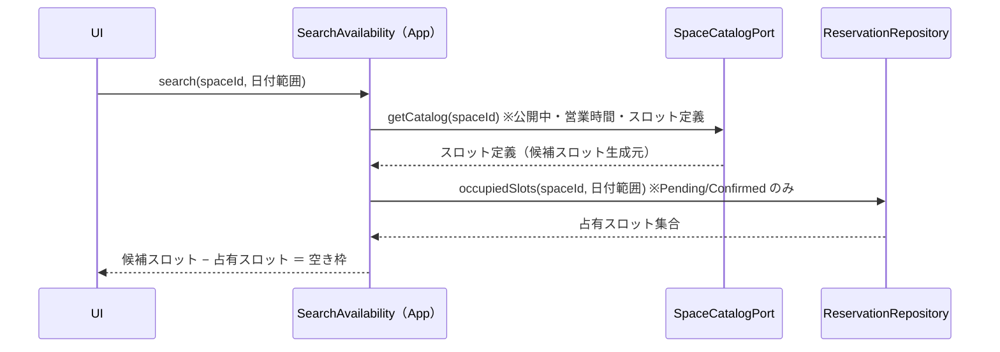

# 設計書: レンタルスペース予約システム

| 項目 | 内容 |
|---|---|
| ステータス | Approved |
| 作成日 | 2026-06-23 |
| 承認日 | 2026-06-23 |
| 要件定義書 | docs/requirements/rental-space-booking.md |

## 1. 設計概要

単一運営者の複数レンタルスペースを対象に、**厳格な DDD（ヘキサゴナル/ポート&アダプタ）** で構成する。境界づけられたコンテキストは要件の5候補を確定させ、**予約コア（Booking）をコアドメイン**、スペース管理・利用者をその上流の支援サブドメイン、決済・通知をポートで隔離した汎用サブドメインとする。

主要な技術判断は4つ:

1. **在庫整合性（ダブルブッキング防止）はリポジトリ層の占有一意性制約で強制**する。ドメインは「Pending/Confirmed が占有する」というルールのみを持ち、一意性のアトミック確保はインフラ（インメモリ=Map+同期 check-and-set／RDS=部分ユニーク制約）が担う。
2. **占有は Pending 永続化と同時に一段階でアトミック確保**し、確保とコミットの間の横取り（FR-013 シナリオ2）を構造的に排除する。
3. **予約×決済の同期フローはアプリケーションサービスがオーケストレーション**（Saga）し、決済成功後の整合違反のみ返金で補償する。ドメインサービスは純粋な検証・計算に限定する。
4. **確定金額・キャンセルポリシーは予約確定時にスナップショット保持**し、後続のスペース改定の影響を受けない。

依存方向は常に **ドメイン ← アプリケーション ← インフラ／UI**。ドメイン層は React・外部SDK・他コンテキストのドメインモデルに一切依存しない。

## 2. コンテキストマップ



依存はすべて **Booking から外側への単方向**。Booking はどのコンテキストのドメインモデルも import せず、ポートが返す**値オブジェクト（Money 等）または読み取り DTO** のみを受け取る。Notification への連携だけは結果整合（ドメインイベント）で、逆流（Notification→Booking）は持たない。

### コンテキスト間の連携一覧

| 発信元 | 宛先 | 経路 | 内容 |
|---|---|---|---|
| Booking | Space | `SpaceCatalogPort`（ID参照＋クエリ） | スロット定義・営業時間・公開状態・min/max・予約可能上限・**料金見積（quote）**・キャンセルポリシースナップショットを値で取得。価格計算ロジックは Space 側に残す |
| Booking | Customer | `CustomerDirectoryPort`（型付きID参照） | ゲスト連絡先から**ゲスト顧客を発行/解決**し `CustomerId` を得る。照会・通知時に連絡先を解決 |
| Booking | Payment | `PaymentPort`（同期呼び出し） | `charge(冪等キー=ReservationId, Money)` / `refund(冪等キー, Money)`。結果 `Succeeded/Failed/TimedOut` |
| Booking | Notification | ドメインイベント（非同期購読） | `ReservationConfirmed` / `ReservationCancelled` / `ReservationReminderDue` を購読し通知（モック） |

> **決済・通知は完全な集約を持つコンテキストではなく、ポートで隔離した外部統合**として扱う（汎用サブドメイン）。決済アダプタのみ冪等・返金管理のため軽量レコード（`PaymentRecord`）を保持する。Booking はその内部に依存しない（ADR-001）。

## 3. ドメインモデル

### 集約一覧

| 集約 | 集約ルート | 含まれるエンティティ/VO | 不変条件 |
|---|---|---|---|
| **予約** | `Reservation` | `ReservationNumber`(VO), `SlottedPeriod`(VO: 連続スロット群), `SlotTime`(VO), `ReservationStatus`(VO), `ConfirmedPrice`(Money, 確定時スナップショット), `CancellationPolicy`(VO, 確定時スナップショット), `PaymentRef`(VO), `SpaceId`/`CustomerId`(参照) | ①スロットは連続 ②スロット数が min/max 範囲内 ③営業時間内・公開中スペース ④開始は未来かつ予約可能上限以内 ⑤状態遷移は規定の遷移のみ ⑥終端状態(Cancelled/NoShow/Aborted)は不変 ⑦キャンセルは Confirmed かつ利用終了前のみ |
| **スペース** | `Space` | `BusinessHours`(VO), `SlotDefinition`(VO: スロット長), `RatePlan`(VO: 曜日×時間帯→単価の集合), `RateRule`(VO), `CancellationPolicy`(VO: 締切×料率の段階), `PublishState`(VO), `Capacity`(VO) | ①スロット長は営業時間を割り切る ②生成スロットは営業時間内のみ ③RatePlan は営業時間内の全スロットを被覆。不被覆スロットは登録時に設定不備として検出し、実行時は予約不可として扱う（既定単価フォールバックはしない, FR-005） ④料率は0–100%・締切は昇順 ⑤単価・金額は0以上 |
| **顧客** | `Customer` | `CustomerType`(VO: Member/Guest), `ContactInfo`(VO: 氏名/Email/Phone), `Credential`(VO, モック認証, Member のみ) | ①Email 形式が妥当 ②Member は資格情報を持つ／Guest は持たない ③連絡先は予約照会・通知の照合に用いる |
| **決済記録**（決済アダプタ内） | `PaymentRecord` | `IdempotencyKey`(VO), `Money`, `PaymentState`(VO), `Refund`(子) | ①同一冪等キーは1回のみ与信（FR-020） ②返金累計は与信額を超えない |

**設計のポイント — 在庫はどの集約が持つか**: スペースの「どのスロットが埋まっているか」は **Space 集約にも Reservation 集約のフィールドにも持たせない**。占有は「(スペース, スロット時刻) の一意性」というクロス集約の制約であり、これをドメインの集約に閉じ込めると巨大集約化する。したがって**占有の一意性はリポジトリ（インフラ）が強制**し、ドメインは「占有するのは Pending/Confirmed」というルールだけを表現する（ADR-002）。これにより Space 集約は「設定」（予約のたびに変わらない）、Reservation 集約は「1件の予約」に保たれ、両者とも小さく保てる。

### ドメインサービス

| サービス | 所属 | 役割（純粋・副作用なし） |
|---|---|---|
| `ReservationPolicy` | Booking ドメイン | 予約成立の不変条件検証（連続性・min/max・営業時間内・過去日時/上限日数）。FR-014 |
| `CancellationFeeCalculator` | Booking ドメイン | 予約のポリシースナップショット × 残時間 × 確定額（× 管理者の0%上書き）→ キャンセル料・返金額。FR-015/019 |
| `RatePlan`（価格計算） | Space ドメイン | 連続スロット群 → 合計 `Money`。料金表不被覆を検出。FR-005/011 |

> 決済オーケストレーション（Pending→決済→Confirmed/破棄）は外部 I/O を伴うため**ドメインサービスに置かず、アプリケーションサービスに置く**（ADR-007）。

### ドメインイベント

| イベント名（過去形） | 発生タイミング | 購読者 |
|---|---|---|
| `ReservationConfirmed` | 決済成功で Confirmed 遷移時 | 通知（確定通知 FR-030）／リマインド予約登録 |
| `ReservationCancelled` | キャンセル成立時（ゲスト/管理者） | 通知（キャンセル通知 FR-031） |
| `ReservationAborted` | 決済失敗/タイムアウトで破棄時 | 観測/ログのみ（ユーザーへのエラーは同期応答） |
| `ReservationReminderDue` | 利用開始24時間前のトリガ発火時 | 通知（リマインド FR-032。発火時に状態確認しキャンセル済みには送らない） |

返金は金額整合が必要なため**キャンセルのユースケース内で同期的に `PaymentPort.refund` を実行**し、イベントは事後通知のみに用いる。

### 状態モデル（永続状態 vs 導出状態）

- **永続状態**: `Pending` / `Confirmed` / `Cancelled` / `NoShow` / `Aborted`
- **導出状態**: `Completed` ＝ `Confirmed` かつ「現在時刻 > 利用終了時刻」。明示遷移コマンドを持たず参照時に導出する（ADR-004, FR-017）。
- **占有する状態**: `Pending` / `Confirmed`（`Completed` 導出中も内部は Confirmed。ただし過去スロットのため新規予約と競合しない）
- **解放する遷移**: `Cancelled` / `Aborted`



## 4. 永続化設計（論理モデル）

> デモはインメモリ実装が主軸（P-10）。本節は**ポートの契約と等価な論理モデル**であり、RDS アダプタ実装時の正規化テーブルでもある。インメモリ実装はこのモデルを Map で鏡写しにする（NFR-006）。



### テーブル定義（主要）

**space**
| カラム | 型 | 制約 |
|---|---|---|
| id | uuid | PK |
| name | text | NOT NULL |
| capacity | int | NOT NULL, CHECK ≥ 0 |
| business_open / business_close | time | NOT NULL（JST, 同一日内, CHECK open < close） |
| slot_minutes | int | NOT NULL, CHECK > 0 |
| min_slots / max_slots | int | NOT NULL, CHECK 1 ≤ min ≤ max |
| bookable_horizon_days | int | NOT NULL, CHECK > 0 |
| publish_state | text | NOT NULL（'Published' / 'Suspended'） |

**rate_rule**（曜日×時間帯→単価。Space 集約内の VO 集合）
| カラム | 型 | 制約 |
|---|---|---|
| space_id | uuid | FK→space, NOT NULL |
| day_kind | text | NOT NULL（'Weekday' / 'Saturday' / 'Sunday'。祝日・日跨ぎは対象外, U-02） |
| from_time / to_time | time | NOT NULL |
| unit_price_jpy | int | NOT NULL, CHECK ≥ 0 |

**cancellation_policy**（Space 集約内 VO。スペースごとに設定可能, U-01）
| カラム | 型 | 制約 |
|---|---|---|
| space_id | uuid | FK→space, NOT NULL |
| tier_order | int | NOT NULL（締切の昇順） |
| hours_before | int | NOT NULL, CHECK ≥ 0（締切: 利用開始のN時間前） |
| fee_rate_pct | int | NOT NULL, CHECK 0 ≤ rate ≤ 100 |

**customer**
| カラム | 型 | 制約 |
|---|---|---|
| id | uuid | PK |
| type | text | NOT NULL（'Member' / 'Guest'） |
| name / email / phone | text | NOT NULL（email は形式バリデーション。**ログ平文出力禁止**, NFR-002） |
| credential | text(nullable) | Member のみ（モック） |

**reservation**
| カラム | 型 | 制約 |
|---|---|---|
| id | uuid | PK |
| reservation_number | text | UNIQUE, NOT NULL |
| space_id | uuid | 参照（**論理FK。モジュール分離のため物理FKは張らない**, ADR-009） |
| customer_id | uuid | 参照（同上） |
| status | text | NOT NULL（Pending/Confirmed/Cancelled/NoShow/Aborted） |
| confirmed_price_jpy | int | NOT NULL, CHECK ≥ 0（**確定時スナップショット**, ADR-006） |
| policy_snapshot | jsonb | NOT NULL（**確定時のキャンセルポリシーをコピー**） |
| payment_idem_key | text | = id（冪等キー） |
| version | int | NOT NULL（楽観ロック。**占有競合ではなく集約の状態遷移競合**（例: 管理者強制キャンセルとゲストキャンセルの並行）の検出用。占有一意性は reservation_slot の部分ユニーク制約で担保） |
| created_at / confirmed_at | timestamptz | |

**reservation_slot**（占有レコード＝ダブルブッキング防止の核）
| カラム | 型 | 制約 |
|---|---|---|
| reservation_id | uuid | FK→reservation, NOT NULL |
| space_id | uuid | NOT NULL |
| slot_start_at | timestamptz | NOT NULL（JST） |

> **占有一意性（核心制約）**: `UNIQUE (space_id, slot_start_at) WHERE reservation.status IN ('Pending','Confirmed')`（**部分ユニークインデックス**）。これによりアクティブな予約のみが占有を主張し、Cancelled/Aborted のスロットは即座に解放される。インメモリ実装はこの制約を `Map<"spaceId#slotEpoch", ReservationId>` の同期 check-and-set で鏡写しにする（ADR-002, ADR-003）。

### インデックス

| テーブル | インデックス | 根拠となる想定クエリ |
|---|---|---|
| reservation_slot | **部分 UNIQUE(space_id, slot_start_at) WHERE active** | FR-013 ダブルブッキング後勝ち拒否（一意性強制） |
| reservation_slot | (space_id, slot_start_at) | FR-010 空き枠照会（占有スロットの範囲取得） |
| reservation | (reservation_number) UNIQUE | FR-016 予約番号照会 |
| reservation | (customer_id, created_at desc) | FR-016 会員の予約履歴一覧 |
| reservation | (status, slot 期間) | FR-019 管理者の絞り込み一覧 |

## 5. アプリケーション API（ユースケース契約）

本システムはインプロセスのヘキサゴナルアプリのため、**一次的な「API」はアプリケーションサービス（コマンド/クエリ）の契約**とする。HTTP/REST 化は RDS バックエンド導入時の将来拡張で、対応するリソース表を併記する。

### コマンド/クエリ一覧

| 種別 | ユースケース | 入力 → 出力 | 要件ID | 将来の REST 対応 |
|---|---|---|---|---|
| Q | `SearchAvailability` | (spaceId?, 日付範囲) → 空きスロット集合 | FR-010 | `GET /spaces/{id}/availability` |
| Q | `QuoteReservation` | (spaceId, slots) → Money | FR-011 | `POST /quotes` |
| C | `PlaceReservation` | (spaceId, slots, 連絡先, 支払情報) → 予約番号 / ConflictError | FR-012/013/014/020 | `POST /reservations` |
| C | `CancelReservation` | (reservationId, byGuest, 照合キー) → キャンセル料/返金額 | FR-015/021 | `POST /reservations/{id}/cancellation` |
| Q | `LookupReservation` | (予約番号, email) → 予約詳細 / not found | FR-016 | `GET /reservations?number=&email=` |
| Q | `ListMyReservations` | (memberId) → 予約一覧 | FR-016 | `GET /me/reservations` |
| C | `RegisterSpace` / `EditSpace` / `SuspendSpace` / `ResumeSpace` | スペース属性 → Space | FR-001/002/003/004/005 | `POST/PATCH /spaces/{id}` |
| Q | `ListAllReservations` | (絞り込み, ページング) → 予約一覧 | FR-019 | `GET /admin/reservations` |
| C | `ForceCancelReservation` | (reservationId, **overrideFeeRate0?**) → 結果 | FR-019（U-06: 管理者のみ0%上書き可） | `POST /admin/reservations/{id}/cancellation` |
| C | `MarkNoShow` | (reservationId) → 結果 | FR-018 | `POST /admin/reservations/{id}/no-show` |
| C | `RegisterMember` / `LoginMock` | 認証情報（モック） → セッション | FR-040 | `POST /auth/*` |
| C | `TriggerReminders` | (基準時刻) → 送信件数 | FR-032（モックトリガ可） | （内部ジョブ） |

### 認可（FR-042）

各管理系ユースケース（`*Space`, `ListAllReservations`, `ForceCancelReservation`, `MarkNoShow`）はアプリケーション層の入口で**管理者ロールを要求**。ゲストロールでの呼び出しは `ForbiddenError`。認可はモック認証アダプタが供給するロールで判定し、ドメイン層には持ち込まない。

### エラーレスポンス規約

ドメイン/アプリは**型付きエラー（判別可能ユニオン）**を返す。本設計で以下を規約とする。

| コード | 意味 | 主な発生元 |
|---|---|---|
| `ValidationError` | 不変条件違反（連続性/min-max/過去日時/必須項目） | FR-014, FR-001 |
| `ConflictError` | 占有競合（後勝ち拒否） | FR-013 |
| `PaymentFailed` | 決済失敗/タイムアウト | FR-012, FR-020 |
| `NotFound` | 予約/スペース不在・照会キー不一致（存在を推測させない） | FR-016 |
| `ForbiddenError` | 認可エラー | FR-042 |
| `IllegalState` | 終端状態への操作（キャンセル不可等） | FR-015 |

> 例外送出ではなく `Result<T, E>` 型で返すことを基本とし（`tsconfig` の厳格設定と相性が良い）、UI 層で表示メッセージにマッピングする。

### ページネーション方針

`ListAllReservations`（FR-019）は**オフセット方式**（`page`, `size`、デフォルト size=20, 上限100）。デモは小規模データ（NFR-001）のためオフセットで十分。大規模化時のカーソル方式への移行余地のみ残す。

## 6. 主要シーケンス

### 6-1. 予約作成（Pending→決済→Confirmed / 破棄）— FR-012/013/014/020



**巻き戻し方針**: 占有は Pending 永続化と同時にアトミック確保するため、確保成功後に同一スロットを他者が奪うことはない（FR-013 シナリオ2 を構造排除, ADR-003）。決済成功後に何らかの整合違反（例: 並行する管理者強制キャンセル）を検出した稀ケースのみ、`PaymentPort.refund` を補償として呼び `abort`。返金は冪等キーで二重実行を防止（FR-020）。

### 6-2. キャンセル（締切＋料率＋返金）— FR-015/021



### 6-3. 空き枠照会 — FR-010



## 7. レイヤ構成（React/TS でのドメイン隔離）

```
src/
  shared/                         # 安定基盤。何にも依存しない
    domain/
      Money.ts                    # JPY 単一通貨の金額VO（多通貨は拡張余地のみ）
      Id.ts                       # ブランド型ID（SpaceId/CustomerId/ReservationId）
      JstDateTime.ts              # JST単一の日時VO
      Result.ts                   # Result<T,E>（型付きエラー）
      DomainEvent.ts / EventBus.ts
      Clock.ts                    # 現在時刻ポート（テスト容易性）
  contexts/
    booking/                      # ★コアドメイン
      domain/
        Reservation.ts            # 集約ルート
        ReservationStatus.ts  ReservationNumber.ts
        SlottedPeriod.ts  SlotTime.ts  PaymentRef.ts
        CancellationPolicy.ts     # 確定時スナップショット用の独立VO（space/domainを参照せず、SpaceCatalogPortのDTOから写像）
        events/ReservationConfirmed.ts ...Cancelled.ts ...Aborted.ts ...ReminderDue.ts
        services/ReservationPolicy.ts  CancellationFeeCalculator.ts
        ports/ReservationRepository.ts            # 占有一意性を含む契約
      application/
        PlaceReservation.ts  CancelReservation.ts  QuoteReservation.ts
        SearchAvailability.ts  LookupReservation.ts  ListMyReservations.ts
        ForceCancelReservation.ts  MarkNoShow.ts  TriggerReminders.ts
        ports/PaymentPort.ts  NotificationPort.ts
              SpaceCatalogPort.ts  CustomerDirectoryPort.ts   # ★Booking が所有（依存性逆転）
      infrastructure/
        InMemoryReservationRepository.ts          # Map＋同期 check-and-set
        # RdsReservationRepository.ts（将来スタブ）
    space/                        # 支援サブドメイン
      domain/Space.ts BusinessHours.ts SlotDefinition.ts RatePlan.ts RateRule.ts
             CancellationPolicy.ts（定義の正本） PublishState.ts
             ports/SpaceRepository.ts
      application/RegisterSpace.ts EditSpace.ts SuspendSpace.ts ResumeSpace.ts
                  SpaceCatalogQueryService.ts     # Booking の SpaceCatalogPort を実装供給
      infrastructure/InMemorySpaceRepository.ts
    customer/                     # 支援サブドメイン
      domain/Customer.ts ContactInfo.ts Credential.ts ports/CustomerRepository.ts
      application/RegisterMember.ts LoginMock.ts CustomerDirectoryService.ts
      infrastructure/InMemoryCustomerRepository.ts
    payment/                      # 汎用（ポート＋モック）
      infrastructure/MockPaymentAdapter.ts        # PaymentRecord・冪等・返金
    notification/
      infrastructure/MockNotificationAdapter.ts   # コンソール出力。通知本文のPIIはマスク表示し、アプリログに平文を残さない（NFR-002）
  composition/                    # 合成ルート（DI）
    container.ts                  # ポート↔実装の束ね（インメモリ/RDS切替点）
    seed.ts                       # 起動時シード（NFR-003）
  ui/                             # React。アプリケーションサービスのみ呼ぶ
    pages/ components/ hooks/     # ドメイン層を直接 import しない
```

**依存ルールの担保**:
- `domain/` は `application/`・`infrastructure/`・`ui/`・他コンテキストのドメインを import しない（NFR-005）。
- コンテキスト越境は**ポートと値オブジェクト/DTO のみ**。`booking/domain` が `space/domain` を import することはない（ADR-009）。`CancellationPolicy` VO は両コンテキストに**独立定義**し（Space=正本定義、Booking=スナップショット用）、`SpaceCatalogPort` の DTO を Booking が自前 VO へ写像する。
- ポート（`*Port`, `*Repository`）の**インターフェイスは駆動する側＝Booking が所有**し、実装（アダプタ）は各 infrastructure と `composition/container.ts` で注入（依存性逆転 → NFR-006 の切替を DI 設定のみで実現）。
- React は `ui/` に隔離。状態管理・描画はドメインに侵入しない。

## 8. ADR（設計判断の記録）

### ADR-001: 決済・通知をポート＋モックで隔離（汎用サブドメイン化）

- **ステータス**: Accepted
- **コンテキスト**: NFR-005/006, FR-020/021/030-032。決済・通知はモックで代替し、実アダプタへ差替え可能にする必要がある。
- **決定**: 決済・通知を完全な集約を持つコンテキストにせず、**Booking が所有するポート（`PaymentPort`/`NotificationPort`）越しの外部統合**とする。決済アダプタのみ冪等・返金管理のため軽量 `PaymentRecord` を保持する。
- **検討した代替案**: (a) 決済を独立コンテキストとして与信/売上集約を作る → デモにはオーバーエンジニアリング。(b) Booking が決済 SDK を直接呼ぶ → ドメインが外部依存（NFR-005 違反）。
- **トレードオフ**: 決済の業務ルール（与信枠・分割等）の表現力を捨てる。デモのモック範囲では問題なし。

### ADR-002: 在庫一意性をリポジトリ層で強制（占有インデックス）

- **ステータス**: Accepted
- **コンテキスト**: FR-013 ダブルブッキング後勝ち拒否。固定スロット制で「(スペース, スロット時刻) の重複なし」を保証する必要。
- **決定**: 占有の一意性を**インフラが強制**する。インメモリは `Map<"spaceId#slotEpoch", ReservationId>` の同期 check-and-set、RDS は `reservation_slot` の**部分ユニークインデックス**（status が Pending/Confirmed のときのみ）。ドメインは「占有するのは Pending/Confirmed」というルールのみを持つ。
- **検討した代替案**: (a) Space 集約が占有スロットを保持 → 予約のたびに Space をロック・肥大化（巨大集約）。(b) Reservation にスロット集合を持たせ保存時に全件突合 → クロス集約一意性をアプリで手実装、競合窓が残る。
- **トレードオフ**: 「占有」というドメイン概念がインフラ契約に薄く滲む。ただしルール（どの状態が占有するか）はドメインに残すことで純粋性は保つ。

### ADR-003: 占有を Pending 永続化と同時に一段階アトミック確保

- **ステータス**: Accepted
- **コンテキスト**: FR-013 シナリオ2「占有確保とコミットの間に横取り」。P-05「Pending も占有」。
- **決定**: 「決済中は仮占有→成功で本確保」の二段階を採らず、**Pending 作成の永続化時点で占有を確定確保**する。確保できなければ即 `ConflictError`。
- **検討した代替案**: 二段階（楽観的仮押さえ→決済→確定）→ 確保とコミットの間に横取り窓が生まれ、補償が常態化する。
- **トレードオフ**: 決済中も他者がそのスロットを取れない（P-05 の通り極短時間）。仮押さえ UI（N分カート保持）は持てないが、要件上スコープ外。

### ADR-004: Completed は導出状態、NoShow/Cancelled/Aborted は永続

- **ステータス**: Accepted
- **コンテキスト**: FR-017（利用終了で完了導出）, §7 状態遷移。
- **決定**: `Completed` は永続させず「Confirmed かつ 現在 > 利用終了」で**参照時に導出**。`NoShow` は管理者手動の明示遷移として永続。
- **検討した代替案**: Completed を明示遷移にしてバッチ/トリガで一斉更新 → デモにスケジューラ常駐が必要・状態とのズレ管理が増える。
- **トレードオフ**: 「完了」一覧は時刻基準のクエリになる。小規模デモでは許容。

### ADR-005: 決済失敗の不成立予約を Aborted 終端状態として残す（U-04）

- **ステータス**: Accepted
- **コンテキスト**: U-04, FR-012, FR-020。トレーサビリティと二重課金防止の要否。
- **決定**: 在庫（占有）は即解放しつつ、予約レコードは **`Aborted` 終端状態で保持**する。冪等キー（=ReservationId）の整合と「なぜ不成立か」の追跡を可能にする。
- **検討した代替案**: Pending を物理削除 → レコードが消え、冪等キー再利用や原因追跡ができない。
- **トレードオフ**: 不成立レコードが蓄積する。デモ規模では無視できる。個人情報は Customer 側参照のみで Aborted 予約に PII は残さない（NFR-002）。

### ADR-006: 確定金額・キャンセルポリシーを確定時スナップショット保持

- **ステータス**: Accepted
- **コンテキスト**: FR-002（料金改定後も既存予約の確定金額維持）, U-01（スペース別ポリシー）。
- **決定**: 予約確定時に**料金（Money）とキャンセルポリシーを予約集約へコピー**し、以後のスペース改定の影響を受けない。
- **検討した代替案**: キャンセル時に Space から最新ポリシーを引く → 改定が遡及し、確定済み予約のキャンセル料が変わる（FR-002 の精神に反する）。
- **トレードオフ**: 予約がポリシーの複製を持ち冗長。整合性（確定時点の約定を守る）を優先。

### ADR-007: 予約×決済の同期オーケストレーションはアプリケーションサービスに置く

- **ステータス**: Accepted
- **コンテキスト**: FR-012。決済は外部 I/O を伴う副作用。
- **決定**: Pending→決済→Confirmed/破棄の**調停（Saga）をアプリケーションサービス**（`PlaceReservation`）に置く。ドメインサービスは純粋な検証・計算（`ReservationPolicy`, `CancellationFeeCalculator`, `RatePlan`）に限定。
- **検討した代替案**: ドメインサービスから決済ポートを呼ぶ → ドメインに外部 I/O が侵入（NFR-005 違反）。
- **トレードオフ**: アプリ層がやや厚くなる。ドメイン純粋性とテスト容易性を優先。

### ADR-008: 全予約を CustomerId で束ね、ゲストも内部顧客化（U-05）

- **ステータス**: Accepted
- **コンテキスト**: U-05, FR-005/016/041。会員・ゲスト双方の予約を一貫して扱う。
- **決定**: ゲスト予約時も `CustomerDirectoryPort.resolveOrIssueGuest` で**ゲスト顧客（Guest 種別）を発行**し、全予約が `CustomerId` を参照。Booking→Customer の単方向 ID 参照。連絡先は Customer 集約が保持し、照会・通知時に解決。
- **検討した代替案**: 予約が連絡先を値で抱える＋会員のみ ID 参照 → 予約と顧客で連絡先が二重管理になり照会照合がぶれる。
- **トレードオフ**: ゲスト予約でも Customer 発行の一手間。予約照会（番号＋email）はクロス集約の読み取り（トランザクション不要）になる。

### ADR-009: コンテキスト越境はドメインモデルを渡さず、値オブジェクト/読み取り DTO のみ

- **ステータス**: Accepted
- **コンテキスト**: NFR-005, FR-011。Booking は Space の料金・定義を必要とするが結合は避けたい。
- **決定**: `booking/domain` は `space/domain` を import しない。**価格計算は Space ドメインに残し**、`SpaceCatalogPort.quote()` が `Money`（値）を返す。構造データ（営業時間・スロット定義・ポリシー）も読み取り DTO/VO で渡す。物理 FK は張らず論理参照に留める。
- **検討した代替案**: Booking が RatePlan を取り込んで自前計算 → 料金ロジックが二重化、Space 改定が Booking に波及。
- **トレードオフ**: 料金計算のため Space へクエリ往復が増える。境界の独立性を優先。

## 9. 要件トレーサビリティ

| 要件ID | 対応する設計項目 | 備考 |
|---|---|---|
| FR-001 | §3 スペース集約, §5 `RegisterSpace` | 必須項目は `ValidationError` |
| FR-002 | §3 確定金額スナップショット, ADR-006 | 既存予約の確定額維持 |
| FR-003 | §3 `PublishState`, §6-1 公開中チェック | 既存確定予約は不変 |
| FR-004 | §3 `BusinessHours`/`SlotDefinition`, §4 space | 営業時間内のみ生成 |
| FR-005 | §3 `RatePlan`（被覆検証）, §4 rate_rule | 不被覆スロットは予約不可（既定単価フォールバックなし） |
| FR-010 | §6-3 `SearchAvailability`, §4 (space_id,slot_start_at) | 占有＝Pending/Confirmed |
| FR-011 | §3 `RatePlan` 計算, §5 `QuoteReservation`, ADR-009 | Space 側で価格算出 |
| FR-012 | §6-1, §5 `PlaceReservation`, ADR-003/007 | Pending→決済→Confirmed/破棄 |
| FR-013 | §3 占有, §4 部分UNIQUE, ADR-002/003 | 後勝ち拒否・横取り構造排除 |
| FR-014 | §3 `ReservationPolicy`, 不変条件①〜④ | 連続/min-max/過去日時/上限 |
| FR-015 | §6-2 `CancelReservation`, §3 `CancellationFeeCalculator`, ADR-006 | 終端状態は IllegalState |
| FR-016 | §5 `LookupReservation`/`ListMyReservations`, ADR-008 | 不一致は NotFound（存在秘匿） |
| FR-017 | §3 状態モデル, ADR-004 | Completed 導出 |
| FR-018 | §5 `MarkNoShow` | 管理者手動・終端 |
| FR-019 | §5 `ListAllReservations`/`ForceCancelReservation`, ページング | U-06 の0%上書き含む |
| FR-020 | §3 `PaymentRecord`, §6-1 冪等キー=ReservationId, ADR-001 | 二重課金防止 |
| FR-021 | §6-2 `refund`, §3 Refund | 部分返金 |
| FR-030 | §3 `ReservationConfirmed`→通知 | モック送信 |
| FR-031 | §3 `ReservationCancelled`→通知 | |
| FR-032 | §5 `TriggerReminders`, `ReservationReminderDue` | キャンセル済みは除外 |
| FR-040 | §7 customer, §5 `RegisterMember`/`LoginMock` | モック認証 |
| FR-041 | ADR-008 `resolveOrIssueGuest` | ログイン不要 |
| FR-042 | §5 認可（管理者ロール要求） | ゲストは Forbidden |
| NFR-001 | §5 オフセットページング, §4 インデックス | 小規模・体感即時 |
| NFR-002 | §4 customer（ログ平文禁止）, ADR-005, §7 通知アダプタ | PII/決済情報をドメイン/ログに残さない |
| NFR-003 | §7 `composition/seed.ts` | 再起動でシード初期化 |
| NFR-004 | §7 Mock*Adapter | 成功/失敗切替で再現 |
| NFR-005 | §2/§7 依存方向, ADR-007/009 | ドメインが React/インフラ非依存 |
| NFR-006 | §7 `container.ts`, ADR-001/002 | DI 設定のみで切替 |
| NFR-007 | §3 `Money`(JPY)/`JstDateTime`(JST) | 単一TZ/通貨VO |

> 対応欄が空の要件＝設計漏れ、表に現れない設計＝過剰設計のチェックに用いた。全 FR/NFR が対応済み。

## 10. 未解決事項

なし。要件 §9 の U-01/U-02/U-04/U-05/U-06 は本設計で確定（ADR-005/006/008・§3・§4 参照）。設計レビューで挙がった以下2点も確定済み。

| # | 論点 | 決定 |
|---|---|---|
| U-03 | リマインド送信タイミング | **24h前1回**（`TriggerReminders` の基準時刻可変）。複数回送信は不要 |
| D-01 | ドメイン/アプリのエラー表現 | **`Result<T,E>` 型に統一**（例外送出はしない）。UI 層で表示メッセージにマッピング |

## 11. 変更履歴

| 日付 | 変更内容 | 変更者 |
|---|---|---|
| 2026-06-23 | 初版作成。未解決事項 U-01/02/04/05/06 を確定し、コンテキスト分割・集約・ポート構成・在庫整合性方式を設計 | Claude |
| 2026-06-23 | レビュー反映。U-03（24h前1回）・D-01（Result型統一）を確定し Approved 化 | Claude |
| 2026-06-23 | 要件↔設計の整合性調査の指摘を反映。通知本文PIIマスク方針(NFR-002)、CancellationPolicy VOの独立定義、version列の用途、FR-005不被覆スロットの実行時挙動を明記 | Claude |
