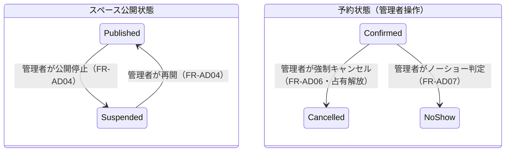

# 要件定義書: レンタルスペース予約システム 管理者(運営者)UI

| 項目 | 内容 |
|---|---|
| ステータス | Approved |
| 作成日 | 2026-06-25 |
| 最終更新 | 2026-06-25 |
| 関連ドキュメント | バックエンド要件: `docs/requirements/rental-space-booking.md`（Approved）／バックエンド設計: `docs/design/rental-space-booking.md`（Approved）／フロント(ゲスト)要件: `docs/requirements/rental-space-booking-frontend.md`（Approved）／フロント(ゲスト)設計: `docs/design/rental-space-booking-frontend.md`（Approved）／管理者UI設計: `docs/design/rental-space-booking-admin-ui.md`（Approved） |

## 1. 背景と課題（Why）

バックエンドには運営管理者向け機能（スペース管理、全予約一覧、強制キャンセル、ノーショー判定、`requireAdmin` 認可）が実装済みだが、**それを操作する管理画面が存在しない**。現状の UI はゲスト/会員フローのみで、運営者は「スペースの登録・料金改定・公開停止」「トラブル予約の強制キャンセル」「ノーショー記録」をブラウザから行えない。これは**現状 UI 化されていない全機能**に相当する。

本要件は、既存の Vite+React SPA に**管理者向けの入口（`/admin`）**を追加し、これらの既存ユースケースを **`webFacade` 経由**で、かつ**一般ユーザーと権限分離して**操作可能にする。加えて、現状ギャップである「管理者ログイン経路（`LoginMock` は Member ロールのみ発行）」を解消する。

## 2. ゴールと成功指標

| ゴール | 成功指標（デモ範囲） |
|---|---|
| 運営者がスペースを自己管理できる | 管理画面から新規登録・編集（料金表/営業時間含む）・公開停止/再開ができ、結果が即座に検索・予約に反映される |
| トラブル予約に介入できる | 全予約を絞り込み一覧し、強制キャンセル（料率0%上書き可）・ノーショー判定ができる |
| 権限が分離される | 非管理者は `/admin` に到達できず、管理系操作は `ForbiddenError` になる |
| 既存約定が保護される | 料金改定後も既存確定予約の金額・キャンセルポリシーが変わらない |
| プライバシーが守られる | 管理画面でも予約者 PII はマスク表示され、平文でログ出力されない |

## 3. ユーザーストーリー

| ID | 誰が | 何のために | 何をする |
|---|---|---|---|
| US-A01 | 管理者 | 貸出枠を増やすため | スペースを新規登録する |
| US-A02 | 管理者 | 運用変更・料金改定のため | スペース属性・営業時間・スロット・料金表・キャンセルポリシーを編集する |
| US-A03 | 管理者 | 一時的に受付を止めるため | スペースを公開停止／再開する |
| US-A04 | 管理者 | 稼働状況を把握するため | 全予約を状態・期間・スペースで絞り込み、ページングで一覧する |
| US-A05 | 管理者 | トラブルに対応するため | 予約を強制キャンセルする（必要に応じ料率0%） |
| US-A06 | 管理者 | 無断不使用を記録するため | 利用後の予約をノーショー判定する |
| US-A07 | 管理者 | 一般ユーザーと権限を分けるため | 管理者としてログインし、管理機能のみにアクセスする |

## 4. 前提条件

> ★は本要件定義で**仮置き**した前提であり、レビューで承認が必要。

- **P-A01**: バックエンドの管理者ユースケース（`RegisterSpace`/`EditSpace`/`SuspendSpace`/`ResumeSpace`/`ListAllReservations`/`ForceCancelReservation`/`MarkNoShow`）と認可 `requireAdmin` は実装済み。UI はこれらを `webFacade` 経由で呼ぶ（ドメイン層を直接 import しない）。
- **P-A02 ★**: 管理者ログインは既存の `LoginMock` を **Admin ロール対応に拡張**して実現する（**バックエンド小改修**）。シードに管理者アカウントを1つ用意する。
- **P-A03**: 管理画面は既存 SPA に **`/admin/*` ルート**として追加し、**管理者ロールでガード**する。非管理者ロール／未ログインは到達不可（FR-042）。
- **P-A04**: 既存フロントの前提を継承する — データ揮発（リロードで初期化, NFR-F03）／実時間 `SystemClock`／JST・JPY 単一／決済・通知・認証はモック／依存方向 `ui→composition→application→domain`（NFR-F04）。
- **P-A05**: 予約者の個人情報（氏名/メール/電話）は**マスク表示**する（NFR-002）。管理者 UI でも平文 PII を表示・ログ出力しない。表示には既存の `CustomerDirectoryPort.contactOf`（マスク出力）を用いる。
- **P-A06**: 料金表・営業時間・ポリシー等の編集は**今後作成される予約に適用**され、既存確定予約の金額・キャンセルポリシーは確定時スナップショットで維持される（FR-002, ADR-006）。
- **P-A07 ★**: 管理者は単一ロール。**複数管理者アカウントの作成・管理（管理者CRUD・権限委譲）はスコープ外**。

## 5. 機能要件

> 各要件はバックエンドの対応 FR を併記する。表示メッセージは型付きエラー（`ValidationError`/`ConflictError`/`ForbiddenError`/`IllegalState`/`NotFound`）の `message` を基本に提示する。

### FR-AD01: 管理者ログイン・ログアウトと認可ガード

- **概要**: 管理者がモック認証でログインし、管理者セッション（Admin ロール）を得る。`/admin/*` は管理者ロールでガードし、未ログイン／非管理者は到達不可。`LoginMock` を Admin ロール発行に対応させる（P-A02）。
- **関連ストーリー**: US-A07 / 対応バックエンド: FR-042
- **優先度**: Must

**受け入れ条件**:

```gherkin
Scenario: 管理者がログインして管理画面に入る
  Given シードの管理者アカウントが存在する
  When 管理者ログイン情報でログインする
  Then 管理者セッションになり、/admin のダッシュボードに遷移する

Scenario: 非管理者は管理画面に到達できない
  Given 一般会員またはゲスト（未ログイン）である
  When /admin 配下の URL に直接アクセスする
  Then 管理画面は表示されず、ログイン要求または「権限がありません」が提示される

Scenario: 管理系操作の認可
  Given 非管理者セッションである
  When 管理系ユースケース（強制キャンセル等）が呼ばれる
  Then ForbiddenError となり操作は実行されない
```

### FR-AD02: スペース新規登録

- **概要**: 管理者がスペースを新規登録する。入力: 名称・定員・営業時間・スロット長・料金表（曜日×時間帯→単価）・キャンセルポリシー（締切×料率の段階）・最小/最大コマ数・予約可能上限日数。登録後は公開状態で検索対象になる。
- **関連ストーリー**: US-A01 / 対応バックエンド: FR-001/004/005
- **優先度**: Must

**受け入れ条件**:

```gherkin
Scenario: 必須項目を入力して登録する
  Given 管理者としてログインしている
  When 名称・定員・営業時間・スロット長・料金表・キャンセルポリシーを入力して登録する
  Then 新しいスペースが作成され、スペース一覧・空き枠検索に現れる

Scenario: 必須項目が欠けている
  Given 管理者としてログインしている
  When 名称を空欄のまま登録する
  Then ValidationError が該当項目付近に提示され、登録されない

Scenario: 料金表が営業時間を被覆していない
  Given 営業時間内に料金表のどの区分にも該当しない時間帯がある
  When 登録する
  Then 「料金表が営業時間を被覆していません」と設定不備が提示され、登録されない（FR-005）
```

### FR-AD03: スペース編集（フル編集）

- **概要**: 管理者がスペースの属性・営業時間・スロット長・料金表・キャンセルポリシー・公開状態を編集する。編集は今後の予約に適用され、既存確定予約の金額・ポリシーは維持される（P-A06）。
- **関連ストーリー**: US-A02 / 対応バックエンド: FR-002/004/005
- **優先度**: Must

**受け入れ条件**:

```gherkin
Scenario: 料金表を改定する
  Given 既存スペースに確定済み予約が存在する
  When 管理者がスロット単価を変更して保存する
  Then 変更後に作成される予約のみ新単価が適用され、既存予約の確定金額は維持される

Scenario: 編集が既存予約に遡及しないことの明示
  Given 編集画面を開いている
  When 料金表・ポリシーを変更しようとする
  Then 「変更は今後の予約に適用され、既存の確定予約には影響しません」と明示される

Scenario: 編集の被覆検証
  Given 営業時間を広げたが料金表を更新していない
  When 保存する
  Then 設定不備（不被覆）が提示され、保存されない
```

### FR-AD04: スペースの公開停止／再開

- **概要**: 管理者がスペースを公開停止／再開する。停止中は新規予約を受け付けないが、既存確定予約は維持される。
- **関連ストーリー**: US-A03 / 対応バックエンド: FR-003
- **優先度**: Must

**受け入れ条件**:

```gherkin
Scenario: 公開停止すると新規予約を受け付けない
  Given 公開中スペースがある
  When 管理者が公開停止する
  Then 一覧で「公開停止」と表示され、ゲストの新規予約が受け付けられなくなる

Scenario: 公開停止しても既存予約は維持される
  Given 公開停止対象スペースに確定済み予約がある
  When 公開停止する
  Then 既存の確定予約は影響を受けず、ゲストはキャンセル可能なまま

Scenario: 再開する
  Given 公開停止中のスペースがある
  When 管理者が再開する
  Then 公開状態に戻り、再び検索・予約の対象になる
```

### FR-AD05: 全予約一覧（絞り込み・ページング）

- **概要**: 管理者が全予約を、状態（Confirmed/Cancelled/NoShow/Aborted/Pending、および導出 Completed）・利用期間・スペースで絞り込み、オフセットページング（size 既定20・上限100）で一覧する。各行に予約番号・スペース・利用日時・金額・状態・予約者（マスク）を表示する。
- **関連ストーリー**: US-A04 / 対応バックエンド: FR-019
- **優先度**: Must

**受け入れ条件**:

```gherkin
Scenario: 状態と期間で絞り込む
  Given 複数の予約が存在する
  When 状態=Confirmed・期間=今週・スペース=会議室A で絞り込む
  Then 条件に一致する予約のみがページングされて表示される

Scenario: 該当0件
  Given 絞り込み条件に一致する予約がない
  When 一覧を表示する
  Then 「該当する予約がありません」と表示され、エラーにはならない

Scenario: 予約者情報のマスク表示
  Given 一覧に予約者情報を表示する
  When 一覧を表示する
  Then 予約者のメール等はマスク表示される（平文を出さない, NFR-002）
```

### FR-AD06: 強制キャンセル（料率0%上書き可）

- **概要**: 管理者がトラブル予約を強制キャンセルする。通常はキャンセルポリシーに従い、管理判断で**料率0%上書き**を選択できる。キャンセル料・返金額を提示し、予約は「キャンセル済（管理者起因）」になりスロットが解放される。
- **関連ストーリー**: US-A05 / 対応バックエンド: FR-019（U-06）
- **優先度**: Must

**受け入れ条件**:

```gherkin
Scenario: ポリシー通りに強制キャンセルする
  Given Confirmed の予約を選択している
  When 強制キャンセルを実行する（0%上書きなし）
  Then ポリシー通りの料率・キャンセル料・返金額が提示され、予約はキャンセル済になる

Scenario: 料率0%で強制キャンセルする
  Given Confirmed の予約を選択している
  When 「キャンセル料を0%にする」を選んで実行する
  Then キャンセル料0円・全額返金となり、予約はキャンセル済になる

Scenario: キャンセル不可の予約
  Given 予約が終端状態（Cancelled/NoShow/Aborted）または利用終了後（Completed導出）である
  When 強制キャンセルしようとする
  Then 「この予約はキャンセルできません」（IllegalState）が提示される
```

### FR-AD07: ノーショー判定

- **概要**: 管理者が、利用終了時刻を過ぎた確定予約をノーショーとしてマークする。ノーショーは終端状態。
- **関連ストーリー**: US-A06 / 対応バックエンド: FR-018
- **優先度**: Should

**受け入れ条件**:

```gherkin
Scenario: ノーショーをマークする
  Given 利用終了時刻を過ぎた Confirmed 予約がある
  When 管理者がノーショーとしてマークする
  Then 予約状態が「ノーショー」になる（終端状態）

Scenario: 対象外の予約をノーショーにできない
  Given 利用終了前、または終端状態の予約である
  When ノーショーにしようとする
  Then 操作が拒否され、その旨が提示される
```

### FR-AD08: 並行競合（楽観ロック）のハンドリング

- **概要**: 強制キャンセル／ノーショー判定が、ゲストのキャンセル等と並行して同一予約に作用した場合（version 競合）、エラーを提示し対象予約・一覧を再取得して最新状態を提示する。
- **関連ストーリー**: US-A05, US-A06 / 対応バックエンド: FR-019（version 楽観ロック）
- **優先度**: Should

**受け入れ条件**:

```gherkin
Scenario: 競合を検出して再取得する
  Given 管理者が予約を操作しようとした時点で、別操作により予約状態が変わっていた
  When 操作を実行する
  Then 「他の操作と競合しました」と提示され、対象予約・一覧が再取得されて最新状態が表示される
```

### FR-AD09: エラー表示（型付きエラーの日本語マッピング）

- **概要**: 管理系ユースケースが返す型付きエラーを日本語で提示する。`ValidationError`（必須項目/料金表不被覆）はフォーム直下、`ForbiddenError` はログイン要求、`IllegalState`/`ConflictError` はバナーで提示し、操作前の状態に戻す。
- **関連ストーリー**: 全管理ストーリー横断 / 対応バックエンド: 全管理 FR
- **優先度**: Must

**受け入れ条件**:

```gherkin
Scenario: 認可エラーはログインへ誘導
  Given 管理者セッションが失われている（リロード後など）
  When 管理系操作を行う
  Then ForbiddenError が提示され、管理者ログインへ誘導される

Scenario: 設定不備は該当箇所に表示
  Given スペース登録/編集で料金表が不被覆である
  When 保存する
  Then ValidationError が該当箇所に提示され、致命的画面遷移は起きない
```

## 6. 非機能要件

| ID | 分類 | 要件 | 測定基準 |
|---|---|---|---|
| NFR-AD01 | セキュリティ／認可 | `/admin` ルートと `webFacade` の管理系メソッドは管理者ロール必須。非管理者は到達・実行不可 | 非管理者で `/admin` に到達できず、管理系呼び出しが `ForbiddenError` になること |
| NFR-AD02 | プライバシー | 予約者 PII はマスク表示し、`console`・通知へ平文出力しない（NFR-002 継承） | 管理画面・ログに生 PII が出ないこと |
| NFR-AD03 | 性能 | デモ小規模・体感即時。一覧はオフセットページング（size 既定20・上限100） | 数十件規模で各操作が概ね1秒以内に反映されること |
| NFR-AD04 | アーキテクチャ | UI はアプリケーションサービス（`webFacade`）のみ呼び、ドメイン層を直接 import しない（NFR-F04 継承）。管理系も `webFacade` に集約 | `src/ui` からドメイン層への直接 import が無いこと |
| NFR-AD05 | 型安全 | backend/ui の2パス型チェックを維持（ADR-F05）。ドメインの DOM/React 非依存をコンパイラで担保 | typecheck（2パス）が通ること |
| NFR-AD06 | 一貫性 | 既存フロントの UI 規約（`Result`→日本語マッピング、コンポーネント様式、ナビゲーション）を踏襲 | ゲスト/会員 UI と統一された体験になっていること |

## 7. 状態遷移

管理者操作が関与する状態遷移（バックエンド設計書 §3/§7 を継承し、管理者が起こす遷移を太字で示す）。



予約状態の全体（Pending/Confirmed/Cancelled/NoShow/Aborted＋導出 Completed）はバックエンド設計書 §7 に従う。終端状態（Cancelled/NoShow/Aborted）・Completed 導出中は強制キャンセル／ノーショー不可。

## 8. スコープ外（やらないこと）

- **監査ログ**: 管理者操作の監査ログ・操作履歴は作らない（バックエンド要件 §8 を継承）。
- **複数管理者アカウントの管理**: 管理者の作成・削除・権限委譲・ロール管理 UI（P-A07）。
- **予約の日時変更**: 管理者による予約の日時変更（キャンセル＋再予約で代替）。
- **スペースの物理削除**: 公開停止（論理）のみ。レコード削除 UI は作らない。
- **一括操作**: 複数予約の一括強制キャンセル等のバッチ操作。
- **実認証・実権限基盤**: OAuth/IDaaS・多要素認証・細粒度パーミッション。認証・認可はモック。
- **分析・レポート**: 稼働率ダッシュボード・売上集計・CSV エクスポート。
- **カーソルページング**: 一覧はオフセット方式のみ（大規模化時の将来拡張）。

## 9. 未解決事項

| # | 論点 | 対応方針 |
|---|---|---|
| U-A01 | `LoginMock` の Admin 対応の詳細 IF（ロール判定・シード管理者アカウント） | 設計フェーズで確定（バックエンド小改修）。 |
| U-A02 | 料金表編集 UI の粒度（行追加/削除のテーブル編集・曜日×時間帯の表現） | 設計フェーズで確定。最も実装量が大きい部分。 |
| U-A03 | 全予約一覧の「予約者」表示 | **決定**: `CustomerDirectoryPort.contactOf` がマスク済み氏名・メールを提供するため、**マスク氏名＋マスクメール**を表示する（平文は出さない, NFR-002）。 |

## 10. 変更履歴

| 日付 | 変更内容 | 変更者 |
|---|---|---|
| 2026-06-25 | 初版作成（ヒアリング→深掘り2ラウンドの確定事項を反映）。対象: 未実装 UI の全て＝管理者(運営者)機能（スペース管理・全予約一覧・強制キャンセル・ノーショー・管理者ログイン）。`LoginMock` の Admin 拡張・フル編集・同一 SPA `/admin` ルート・PII マスク・競合再取得を確定 | Claude |
| 2026-06-25 | サブエージェント評価を反映。U-A03 を解決（マスク氏名＋メールを表示）。設計側で version競合のエラー型・返金失敗・バックエンド改修範囲を訂正（設計書 §10 参照） | Claude |
