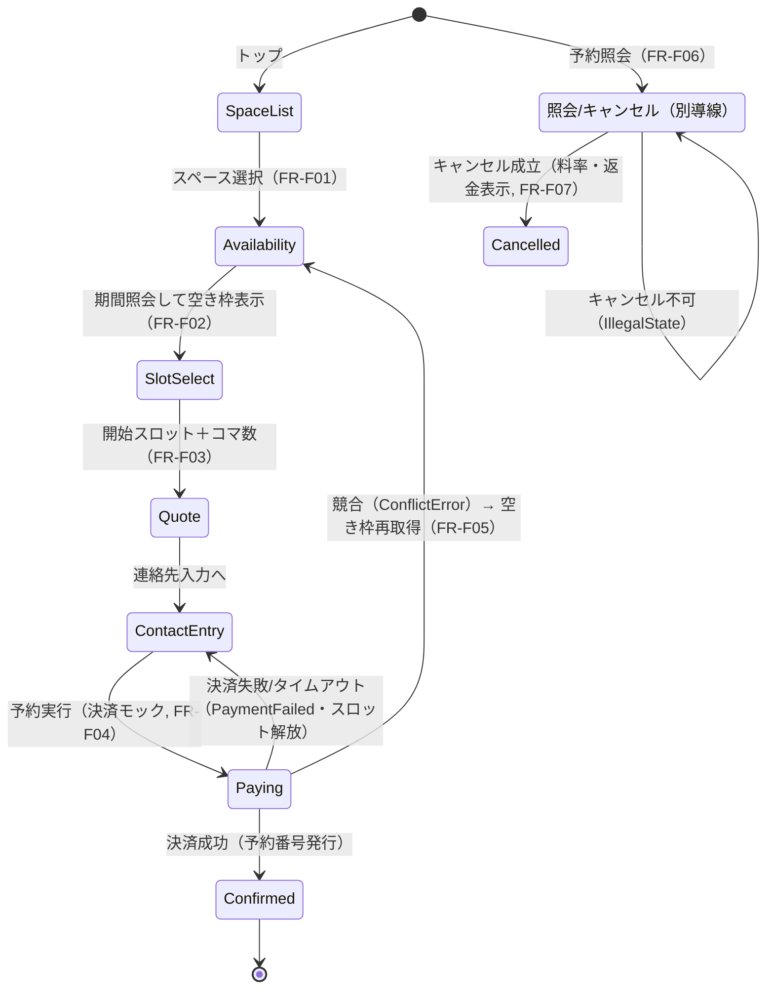

# 要件定義書: レンタルスペース予約システム フロントエンド（ゲスト予約フロー）

| 項目 | 内容 |
|---|---|
| ステータス | Approved |
| 作成日 | 2026-06-24 |
| 最終更新 | 2026-06-24 |
| 関連ドキュメント | バックエンド要件: `docs/requirements/rental-space-booking.md`（Approved）／バックエンド設計: `docs/design/rental-space-booking.md`（Approved）／フロント設計: 本要件確定後に `docs/design/rental-space-booking-frontend.md` を作成予定 |

## 1. 背景と課題（Why）

バックエンドは「空き枠の可視化・即時予約・在庫整合性の担保」を実装済み（予約コア・スペース管理・利用者・決済/通知モック）で、Vitest による受け入れテストも整備されている。しかし**借り手が触れる入口（UI）が存在しない**ため、要件定義書のゴール「ゲストがログインなしで検索→見積→予約→確認までを完結できる」がデモとして体感できない。

本フロントエンドは、その入口を提供する。既存のアプリケーションサービス（DIコンテナ・ユースケース、インメモリ実装）を**ブラウザ内から直接呼ぶ SPA** として実装し、HTTP サーバを介さずに予約フローを成立させる。これは設計書の「UI はアプリケーションサービスのみを呼ぶ。ドメイン層を直接 import しない」という方針に忠実な構成である。

## 2. ゴールと成功指標

| ゴール | 成功指標（デモ範囲） |
|---|---|
| ゲストが自己解決で予約を完結できる | ログインなしで「スペース選択→空き枠確認→見積→決済→確定（予約番号発行）」までブラウザ操作のみで到達できる |
| 予約番号で後から照会・キャンセルできる | 予約番号＋メールで照会し、キャンセル料・返金額を確認してキャンセルできる |
| 会員が履歴を一元管理できる | ログイン後に自分の予約履歴を一覧でき、そこからキャンセルできる |
| バックエンドの異常系がUIで体感できる | ダブルブッキング競合・決済失敗・キャンセル不可などのエラーが画面に適切に提示される |
| モックの結果が可視化される | 確定/キャンセル/リマインドの通知が画面上の通知ログで（PIIマスク済みで）確認できる |

## 3. ユーザーストーリー

| ID | 誰が | 何のために | 何をする |
|---|---|---|---|
| US-F01 | ゲスト | 利用したい場所を選ぶため | スペース一覧から1件を選ぶ |
| US-F02 | ゲスト | 利用日時を確保するため | 期間を指定して複数日の空きスロットを見る |
| US-F03 | ゲスト | 支払額を事前把握するため | 開始スロットと利用コマ数を選び、合計見積もりを見る |
| US-F04 | ゲスト | 場所を押さえるため | 連絡先を入力し（モック）決済して予約を確定し、予約番号を受け取る |
| US-F05 | ゲスト | 後から確認するため | 予約番号＋メールで予約を照会する |
| US-F06 | ゲスト | 予定変更のため | 照会した予約をキャンセルし、キャンセル料・返金額を確認する |
| US-F07 | 会員 | 予約を自分の履歴に紐づけるため | ログインして予約する |
| US-F08 | 会員 | 過去の利用を管理するため | ログイン後に予約履歴を一覧し、そこからキャンセルする |
| US-F09 | デモ利用者 | バックエンド挙動を確認するため | 通知ログを見る／リマインド送信・決済挙動を切り替える |

## 4. 前提条件

> ★は本要件定義で**仮置き**した前提であり、レビューで承認が必要。

- **P-F01**: バックエンド（ドメイン/アプリ/インフラ層・DIコンテナ・シード）は実装済み。フロントは `createContainer()` が返すユースケースを呼ぶのみで、ドメイン層を直接 import しない（設計書 §7 の依存ルール）。
- **P-F02**: 永続化はバックエンドのインメモリ実装に従い、**ブラウザリロードでデータ揮発を許容**する（NFR-003）。起動時にシードで初期化する。会員ログインセッション・通知ログもメモリ保持であり、リロードで失われる。
- **P-F03 ★**: 現在時刻は実時間（`SystemClock`）を用いる。過去日時不可・予約可能上限・リマインド基準時刻はすべて実時間で判定する（バックエンドのデモで用いた `FixedClock` はフロントでは使わない）。
- **P-F04 ★**: シードに**複数スペース**（例: 会議室A・スタジオB）と、ログインデモ用の**会員を1名**用意する。
- **P-F05**: 会員予約は、ログイン中の会員の `customerId` を予約作成時に明示的に渡して紐づける。これには `PlaceReservation` が任意の `customerId`（または認証済み `Actor`）を受け取る**小規模なバックエンド改修**が必要で、設計フェーズで対応する（U-F01）。ゲスト（非ログイン）予約は従来どおり連絡先から `resolveOrIssueGuest` でゲスト顧客を発行する。これにより会員予約は `ListMyReservations(memberId)` の履歴に確実に現れる。
- **P-F06 ★**: 決済のモック挙動（成功/失敗/タイムアウト）は `MockPaymentAdapter.setBehavior` のグローバル設定で切り替える。デモ操作パネルから変更し、次回の決済に反映される。
- **P-F07**: 連続スロットは「1スペース・同一営業日内」のみ（日跨ぎ不可）。UI は利用コマ数を同日内の連続する空き枠の範囲に制約する。

## 5. 機能要件

> 表示メッセージは、バックエンドが返す型付きエラー（`ValidationError`/`ConflictError`/`PaymentFailed`/`NotFound`/`ForbiddenError`/`IllegalState`）の `message` を基本に提示する（FR-F12）。

### FR-F01: スペース一覧と選択

- **概要**: シード済みのスペースを一覧表示し、ゲストが1件を選択する。各スペースの名称・営業時間・スロット長・収容人数などの概要を表示する。
- **関連ストーリー**: US-F01
- **優先度**: Must

**受け入れ条件**:

```gherkin
Scenario: スペース一覧から選択する
  Given シードに複数のスペースが登録されている
  When ゲストがトップ画面を開く
  Then 各スペースの概要が一覧表示され、1件を選ぶと空き枠照会画面に進む

Scenario: 公開停止中のスペースの扱い
  Given あるスペースが公開停止（Suspended）である
  When 一覧を表示する
  Then 公開停止スペースは一覧に表示されない、または「予約受付停止中」と明示され選択できない
```

### FR-F02: 空き枠照会（期間指定・複数日表示）

- **概要**: 選択スペースについて、開始日〜終了日の期間を指定し、その期間内の空きスロットを**日ごとにまとめて**表示する。空き＝営業時間内スロット−（Pending/Confirmed が占有するスロット）。
- **関連ストーリー**: US-F02
- **優先度**: Must

**受け入れ条件**:

```gherkin
Scenario: 期間内の空き枠を日別に表示する
  Given スペースを選択し、開始日と終了日を指定している
  When 空き枠を照会する
  Then 期間内の各営業日ごとに、空きスロット開始時刻の一覧が表示される

Scenario: 確定予約のあるスロットは表示されない
  Given ある日の10:00-11:00スロットに確定予約がある
  When その日を含む期間の空き枠を照会する
  Then その日の10:00枠は空きとして表示されない

Scenario: 空きが1件もない
  Given 指定期間の全スロットが予約済み、または営業日が含まれない
  When 空き枠を照会する
  Then 「空きなし」が明示され、エラーにはならない
```

### FR-F03: スロット選択と見積もり

- **概要**: 表示された空き枠から**開始スロット**を選び、**利用コマ数**（スロット数）を指定する。指定に応じてバックエンドの見積もり（`QuoteReservation`）を呼び、合計金額を提示する。コマ数の上下限（min/max）と同日内連続の制約をUIで誘導する。
- **関連ストーリー**: US-F03
- **優先度**: Must

**受け入れ条件**:

```gherkin
Scenario: 開始スロットとコマ数から見積もりを表示する
  Given 平日の17:00開始を選び、利用コマ数を2に指定している（17:00-18:00=1000円, 18:00-19:00=2000円のスペース）
  When 見積もりを要求する
  Then 合計3000円が提示される

Scenario: 最小/最大コマ数の範囲外は選べない
  Given スペースの最小2・最大8コマである
  When コマ数を1に指定しようとする
  Then 範囲外は選べない（または「最小2コマからの予約です」と提示され確定に進めない）

Scenario: 同日内の連続範囲を超えるコマ数
  Given 残り空き枠が同日内で2コマ分しかない開始スロットを選んでいる
  When コマ数を3に指定する
  Then 選択不可、または確定時にバックエンドの検証エラーが提示される
```

### FR-F04: 予約確定（連絡先入力＋決済モック）

- **概要**: 連絡先（氏名・メール・電話）を入力し、決済（モック）を実行して予約を確定する。`PlaceReservation` を呼び、成功で予約番号を表示する完了画面に遷移する。決済挙動はデモ操作パネルの設定（成功/失敗/タイムアウト）に従う。
- **関連ストーリー**: US-F04
- **優先度**: Must

**受け入れ条件**:

```gherkin
Scenario: 決済成功で予約が確定する
  Given 空き連続スロットと連絡先を入力し、決済挙動が「成功」である
  When 予約を実行する
  Then 予約が確定し、予約番号・確定金額・利用日時を含む完了画面が表示される

Scenario: 決済失敗で予約が成立しない
  Given 決済挙動が「失敗」である
  When 予約を実行する
  Then 「決済に失敗しました。スロットは解放されました」と提示され、完了画面に進まない

Scenario: 必須項目の未入力
  Given メールアドレスが未入力または形式不正である
  When 予約を実行する
  Then 入力エラーが該当項目に提示され、決済は実行されない
```

### FR-F05: 予約確定直前の競合ハンドリング

- **概要**: 空き枠表示から確定実行までの間に他者が同スロットを確保していた場合（`ConflictError`）、エラーを提示したうえで当該スペースの空き枠を**自動的に再取得**し、選び直しを促す。
- **関連ストーリー**: US-F04
- **優先度**: Should

**受け入れ条件**:

```gherkin
Scenario: 確定直前に競合した
  Given 選択中のスロットが、確定実行の直前に他予約で占有された
  When 予約を実行する
  Then 「すでに予約されました」と提示され、空き枠が再取得されて最新状態が表示される
```

### FR-F06: 予約照会（番号＋メール）

- **概要**: 予約番号と予約時メールアドレスで予約を照会し、日時・スペース・金額・状態（Completed 導出含む）を表示する。`LookupReservation` を呼ぶ。
- **関連ストーリー**: US-F05
- **優先度**: Must

**受け入れ条件**:

```gherkin
Scenario: 予約番号＋メール一致で詳細表示
  Given 確定済み予約の予約番号とメールを入力する
  When 照会する
  Then 当該予約の日時・スペース・金額・状態が表示される

Scenario: 照会キー不一致
  Given 予約番号は正しいがメールが一致しない、または番号が存在しない
  When 照会する
  Then 「該当する予約が見つかりません」と表示され、存在を推測させない
```

### FR-F07: 予約キャンセル

- **概要**: 照会した予約、または会員履歴の予約をキャンセルする。`CancelReservation` を呼び、キャンセル料率・キャンセル料・返金額を提示する。終端状態・利用終了後（Completed）はキャンセル不可を提示する。
- **関連ストーリー**: US-F06, US-F08
- **優先度**: Must

**受け入れ条件**:

```gherkin
Scenario: キャンセル料と返金額を提示する
  Given 確定予約があり、キャンセルポリシーに基づく料率が適用される
  When キャンセルを実行する
  Then 料率・キャンセル料・返金額が表示され、予約状態が「キャンセル済」になる

Scenario: キャンセル不可の予約
  Given 予約が利用終了後（Completed導出）または既にキャンセル済み（終端）である
  When キャンセルしようとする
  Then 「この予約はキャンセルできません」と提示される
```

### FR-F08: 会員登録・ログイン／ログアウト（モック）

- **概要**: モック認証で会員登録（`RegisterMember`）・ログイン（`LoginMock`）・ログアウトを行う。ログイン状態はメモリ保持（リロードで失われる, P-F02）。ログイン中の予約は会員の `customerId` で紐づける（P-F05, U-F01）。
- **関連ストーリー**: US-F07
- **優先度**: Should（本イテレーションのスコープ内）

**受け入れ条件**:

```gherkin
Scenario: ログインして会員として予約する
  Given シードの会員アカウントでログインしている
  When 予約フローを進める
  Then 確定予約が会員の customerId に紐づき、予約履歴に現れる

Scenario: 認証失敗
  Given 誤ったログインID/シークレットを入力する
  When ログインする
  Then 「ログインに失敗しました」と提示され、ログイン状態にならない
```

### FR-F09: 予約履歴一覧（会員）

- **概要**: ログイン中の会員の予約履歴を新しい順に一覧する（`ListMyReservations`）。各予約の日時・スペース・金額・状態（Completed 導出含む）を表示し、キャンセル可能なものはキャンセル導線を提示する。
- **関連ストーリー**: US-F08
- **優先度**: Should（本イテレーションのスコープ内）

**受け入れ条件**:

```gherkin
Scenario: 履歴を一覧する
  Given ログイン中の会員に複数の予約がある
  When 履歴画面を開く
  Then 予約が新しい順に一覧され、各状態（Confirmed/Cancelled/Completed等）が表示される

Scenario: 履歴が空
  Given ログイン中の会員に予約がない
  When 履歴画面を開く
  Then 「予約がありません」と表示され、エラーにはならない
```

### FR-F10: 通知ログパネル

- **概要**: モック通知（確定/キャンセル/リマインド）を画面上のパネルに一覧表示する。`MockNotificationAdapter` が保持するメッセージを表示し、内容は PII マスク済み（NFR-002）。
- **関連ストーリー**: US-F09
- **優先度**: Should

**受け入れ条件**:

```gherkin
Scenario: 確定で通知が表示される
  Given 予約を確定した
  When 通知ログパネルを見る
  Then 確定通知が1件、マスク済み宛先（例 h***@example.com）で表示される

Scenario: 通知本文に生PIIが含まれない
  Given 任意の通知が発生した
  When 通知ログを表示する
  Then 氏名・メールは平文ではなくマスク表示される
```

### FR-F11: デモ操作パネル

- **概要**: デモ用に、(a) 決済挙動（成功/失敗/タイムアウト）の切替、(b) リマインド送信トリガ（`TriggerReminders`、基準時刻=現在）を提供する。
- **関連ストーリー**: US-F09
- **優先度**: Could

**受け入れ条件**:

```gherkin
Scenario: 決済挙動を切り替える
  Given デモ操作パネルで決済挙動を「失敗」に設定する
  When 次の予約を実行する
  Then その予約は決済失敗として扱われる

Scenario: リマインドを手動送信する
  Given 利用開始24時間以内の確定予約がある
  When 「リマインド送信」を実行する
  Then 当該予約にリマインド通知が送られ、通知ログに表示される（キャンセル済みには送られない）
```

### FR-F12: エラー表示（型付きエラーの日本語マッピング）

- **概要**: ユースケースが返す `Result` の型付きエラーを、画面上で日本語メッセージとして提示する。エラー種別（kind）に応じて提示箇所（フォーム直下／全体トースト／確認ダイアログ）を使い分ける。
- **関連ストーリー**: 全ストーリー横断
- **優先度**: Must

**受け入れ条件**:

```gherkin
Scenario: 入力検証エラーは該当箇所に表示
  Given ValidationError が返る操作をした
  When 結果を受け取る
  Then エラーメッセージが該当フォーム付近に提示され、致命的画面遷移は起きない

Scenario: 競合・決済失敗はフローを巻き戻す
  Given ConflictError または PaymentFailed が返る
  When 結果を受け取る
  Then 明確なメッセージとともに、選択し直し可能な状態に戻る
```

## 6. 非機能要件

| ID | 分類 | 要件 | 測定基準 |
|---|---|---|---|
| NFR-F01 | 性能 | ブラウザ内のインメモリ処理。主要操作は体感即時 | 数十件規模で各操作が概ね1秒以内に画面反映される |
| NFR-F02 | セキュリティ／プライバシー | PII（氏名/メール/電話）を `console`・通知本文へ平文出力しない。通知はマスク表示（バックエンド NFR-002 を UI でも遵守）。決済情報は保持・表示しない | 通知ログ・コンソールに生 PII が出ないこと |
| NFR-F03 | 可用性 | デモ前提。リロードでデータ揮発を許容し、起動時シードで初期化（バックエンド NFR-003 準拠） | リロード後にシード状態から再開でき、状態不整合が残らない |
| NFR-F04 | アーキテクチャ | UI 層はアプリケーションサービス（ユースケース）のみを呼び、ドメイン層を直接 import しない（設計書 §7 の依存ルール） | `ui/`（フロント）からドメイン層への直接 import が無いこと |
| NFR-F05 | 保守性 | 型付きエラーは網羅的に分岐し、未処理エラーで画面が壊れない | 全エラー種別に表示マッピングがあること |
| NFR-F06 | 技術前提 | Vite + React + TypeScript（strict）。日付/金額はバックエンドの VO 表現（JST/JPY）を踏襲 | ビルド・型チェックが通ること |

## 7. 状態遷移

予約フロー（UI ウィザード）の画面状態と遷移。



会員導線: `ログイン（FR-F08）→ 履歴一覧（FR-F09）→ 各予約からキャンセル（FR-F07）`。予約データ自体の状態（Pending/Confirmed/Cancelled/NoShow/Aborted/Completed導出）はバックエンド設計書 §3/§7 に従い、フロントは導出状態を含めて表示する。

## 8. スコープ外（やらないこと）

- **管理者画面**: スペース登録/編集/公開停止、全予約一覧、強制キャンセル、ノーショー判定（FR-001〜005, FR-018/019）。バックエンドには存在するが UI は今回作らない（将来拡張）。
- **HTTP API 層・サーバ**: バックエンドをサーバ化せず、ブラウザ内でアプリ層を直接呼ぶ。REST 化はバックエンド設計書のとおり将来拡張。
- **データの永続化（localStorage 等）**: リロードでの揮発を許容（P-F02）。
- **実決済・実認証・実通知**: すべてモック。カード情報入力 UI・PCI 対応・OAuth/IDaaS・メール/SMS 実送信は対象外。
- **予約の日時変更**: キャンセル＋再予約で代替（バックエンド方針に同じ）。
- **レスポンシブ/アクセシビリティの作り込み・多言語化・テーマ**: デモ最小限にとどめる。
- **大規模データ向けの仮想スクロール等の最適化**。

## 9. 未解決事項

| # | 論点 | 決定/対応方針 |
|---|---|---|
| U-F01 | 会員予約の紐づけ方式 | **決定**: `PlaceReservation` に任意の `customerId`（または認証済み `Actor`）を受け取る小改修を行い、ログイン会員は `customerId` で厳密に紐づける（設計フェーズで実施・バックエンド変更）。ゲストは従来どおり `resolveOrIssueGuest`。 |
| U-F02 | スタイリング方針 | デモ前提のため独自最小 CSS を仮置き。UI ライブラリ採用の要否は設計で確定。 |
| U-F03 | シードの具体内容（スペース数・会員アカウント） | 設計フェーズで確定。最低2スペース＋デモ会員1名を想定（P-F04）。 |

## 10. 変更履歴

| 日付 | 変更内容 | 変更者 |
|---|---|---|
| 2026-06-24 | 初版作成（ヒアリング→深掘り2ラウンドの確定事項を反映）。スコープ: ゲスト予約フロー＋会員ログイン/履歴＋通知/デモパネル。構成は Vite+React でアプリ層を直接呼ぶ SPA | Claude |
| 2026-06-24 | レビュー反映。会員予約を `customerId` で厳密に紐づける方針に変更（`PlaceReservation` の小改修を設計で実施, U-F01決定）。スコープ・優先度を承認し Approved 化 | Claude |
