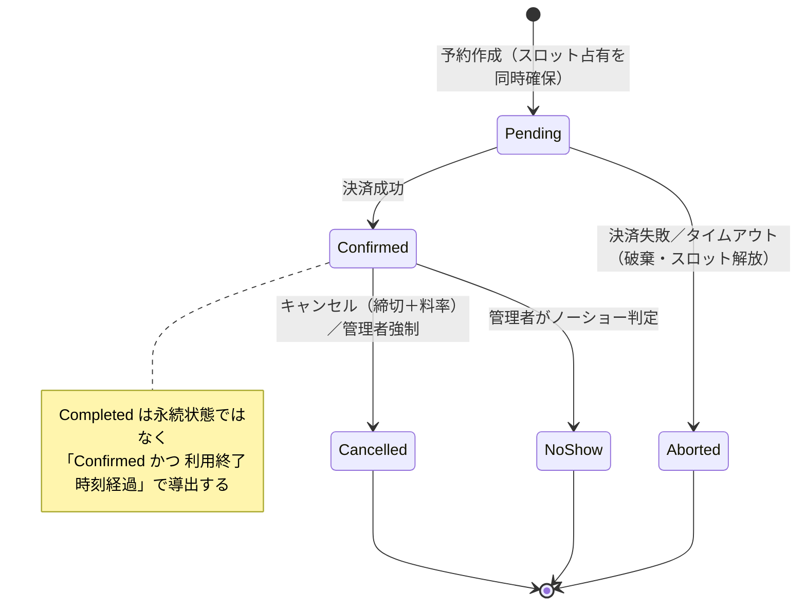

# 要件定義書: レンタルスペース予約システム

| 項目 | 内容 |
|---|---|
| ステータス | Approved |
| 作成日 | 2026-06-23 |
| 最終更新 | 2026-06-23 |
| 関連ドキュメント | 設計書: `docs/design/rental-space-booking.md`（Approved） |

## 1. 背景と課題（Why）

単一の運営者が複数のレンタルスペース（会議室・スタジオ等）を時間貸ししている。現状は電話・メール・台帳での予約管理が想定され、次の痛みがある。

- **ダブルブッキング**: 口頭・手作業の管理で同一時間帯の二重予約が発生しうる。
- **空き状況の不可視性**: 借り手がリアルタイムに空き枠を確認できず、問い合わせコストが高い。
- **料金計算・キャンセル処理の属人化**: 時間帯・曜日で異なる単価やキャンセル料の計算が手作業でミスを生む。

本システムは、空き枠の可視化・即時予約・在庫整合性の担保により、これらを解消する。なお現状は**デモ**であり、永続化はインメモリを主軸とし、決済・通知・認証はモック実装で代替する。

## 2. ゴールと成功指標

| ゴール | 成功指標（デモ範囲） |
|---|---|
| ダブルブッキングを構造的に発生させない | 同一スロットへの競合予約が必ず一方だけ成功し、他方は明示エラーになる |
| 借り手が空き枠を自己解決で予約できる | ゲストがログインなしで検索→見積→予約→確認までを完結できる |
| 料金・キャンセル料が一貫して自動計算される | 時間帯/曜日別単価とキャンセル料率がコードで一意に算出される |
| 永続化層を差し替え可能にする | リポジトリをインターフェイス化し、インメモリ実装とRDS実装をDI設定のみで切替できる |

## 3. ユーザーストーリー

| ID | 誰が | 何のために | 何をする |
|---|---|---|---|
| US-001 | ゲスト（借り手） | 利用したい日時の場所を確保するため | スペースを検索し空き枠を確認する |
| US-002 | ゲスト | 支払額を事前に把握するため | 選択スロットの料金見積もりを得る |
| US-003 | ゲスト | 場所を確実に押さえるため | 決済を伴って予約を確定する |
| US-004 | ゲスト | 予定変更に対応するため | 予約をキャンセルする（キャンセル料を確認する） |
| US-005 | ゲスト（非会員） | アカウントを作らず使うため | 氏名・連絡先を入力してゲスト予約し、予約番号で照会する |
| US-006 | 会員ゲスト | 過去の利用を管理するため | ログインして予約履歴を一覧する |
| US-007 | 運営管理者 | 稼働率を上げるため | スペース・営業時間・スロット・料金表を登録/編集/停止する |
| US-008 | 運営管理者 | トラブルに対応するため | 全予約を一覧し、強制キャンセルやノーショー判定を行う |
| US-009 | ゲスト | 利用を忘れないため | 利用前リマインド通知を受け取る |

## 4. 前提条件

> 暗黙の前提を明文化したもの。★は本要件定義で**仮置き**した前提であり、レビューで承認が必要。

- **P-01**: スペース・営業時間・スロット定義・料金表は、予約に先立って管理者が登録済みである。
- **P-02 ★**: 1件の予約は「**1スペース内の連続したスロット群**」を対象とする。複数スペースまたぎ・非連続スロットの予約は不可。最小/最大予約時間は「連続スロット数」で表現する。
- **P-03 ★**: 同一ゲストが、異なるスペースまたは時間的に重ならない複数の予約を持つことは可能。重複判定は「**同一スペース・同一スロットの時間重複**」を単位とする。
- **P-04**: 予約は**即時確定**（運営/オーナーによる承認ステップなし）。ただし決済が成功して初めて「確定」状態になる（§7参照）。
- **P-05 ★**: Pending（決済処理中）の予約も在庫判定上スロットを占有し、Confirmedと同等に重複対象として扱う。占有は同期決済処理中の極短時間に限られ、ユーザー向けの「N分間カート保持」機能ではない。
- **P-06 ★**: 完了（Completed）は利用終了時刻の経過により導出する。ノーショー（NoShow）判定は**管理者の手動マーク**による（自動検知はしない）。
- **P-07 ★**: タイムゾーンは**JST単一**、通貨は**JPY単一**。タイムゾーン跨ぎ・多通貨は将来拡張とし、今回は値オブジェクトの設計余地のみ残す。
- **P-08**: 決済・通知・認証は**インターフェイス（ポート）を定義し、実装はモックアダプタ**とする。決済の内部処理（与信・返金）は副作用を持たず、成功/失敗を制御可能なモックで再現する。
- **P-09 ★**: リマインドは利用開始の**24時間前に1回**送信する。スケジューラ/時刻トリガーはデモではモック（手動トリガーまたは簡易タイマー）で代替してよい。
- **P-10**: 永続化はインメモリを主軸とし、プロセス再起動でデータが揮発することを許容する。起動時にシードデータで初期化する。

## 5. 機能要件

> 境界づけられたコンテキスト（候補）ごとに整理する。コンテキスト分割の確定は設計フェーズ（`architecture-design`）で行う。

### コンテキストA: スペース管理

#### FR-001: スペースの登録

- **概要**: 管理者がスペース（名称・収容人数・説明等）を新規登録する。
- **関連ストーリー**: US-007
- **優先度**: Must

```gherkin
Scenario: 管理者がスペースを登録する
  Given 管理者としてログインしている
  When 名称・収容人数・営業時間・スロット定義・料金表を入力して登録する
  Then 新しいスペースが「公開」状態で作成され、検索対象になる

Scenario: 必須項目が欠けている
  Given 管理者としてログインしている
  When 名称を空欄のまま登録する
  Then バリデーションエラーとなり、どの項目が不足かが通知される
```

#### FR-002: スペースの編集

- **概要**: 管理者がスペースの属性・営業時間・スロット定義・料金表を編集する。
- **関連ストーリー**: US-007
- **優先度**: Must

```gherkin
Scenario: 料金表を改定する
  Given 既存スペースに確定済み予約が存在する
  When 管理者がスロット単価を変更する
  Then 変更後に作成される予約のみ新単価が適用され、既存予約の確定金額は維持される
```

#### FR-003: スペースの公開停止／再開

- **概要**: 管理者がスペースを論理的に公開停止/再開する。停止中は新規予約を受け付けないが、既存の確定予約は維持される。
- **関連ストーリー**: US-007
- **優先度**: Should

```gherkin
Scenario: 公開停止中のスペースは新規予約不可
  Given スペースが「公開停止」状態である
  When ゲストがそのスペースの空き枠を予約しようとする
  Then 予約は受け付けられず「現在予約を受け付けていません」と表示される

Scenario: 公開停止しても既存予約は維持される
  Given スペースに確定済み予約が存在する
  When 管理者がスペースを公開停止する
  Then 既存の確定予約は影響を受けず、当該ゲストはキャンセル可能なまま
```

#### FR-004: 営業時間・スロット定義の設定

- **概要**: スペースごとに営業時間と固定スロット（例: 09:00–10:00 を1スロット）を定義する。
- **関連ストーリー**: US-007
- **優先度**: Must

```gherkin
Scenario: 営業時間外のスロットは生成されない
  Given 営業時間が 09:00–18:00、スロット長が60分と設定されている
  When スロットを生成する
  Then 09:00開始〜17:00開始の9スロットが生成され、営業時間外のスロットは存在しない
```

#### FR-005: 料金表（時間帯/曜日別単価）の設定

- **概要**: スペースごとに「曜日 × 時間帯 → スロット単価」の料金表を設定する。
- **関連ストーリー**: US-007, US-002
- **優先度**: Must

```gherkin
Scenario: 平日昼と土日夜で単価が異なる
  Given 料金表が「平日09:00-18:00=1000円/スロット」「土日18:00-22:00=2000円/スロット」と設定されている
  When 各時間帯のスロット単価を参照する
  Then それぞれ1000円・2000円が返る

Scenario: 料金表に該当しない時間帯
  Given あるスロットの曜日・時間帯が料金表のどの区分にも一致しない
  When 単価を参照する
  Then 設定不備として検出され、そのスロットは予約不可として扱われる（既定単価フォールバックはしない）
```

### コンテキストB: 予約（コアドメイン）

#### FR-010: スペース検索・空き枠照会

- **概要**: ゲストが日付・条件でスペースを検索し、各スペースの空きスロットを参照する。空き = 営業時間内スロット − （Confirmed または Pending の予約が占有するスロット）。
- **関連ストーリー**: US-001
- **優先度**: Must

```gherkin
Scenario: 確定予約のあるスロットは空きから除外される
  Given スペースXの 10:00-11:00 スロットに確定予約がある
  When ゲストがスペースXの当日の空き枠を照会する
  Then 10:00-11:00 は空きスロットとして表示されない

Scenario: 空きが1件もない
  Given 対象日の全スロットが予約済みである
  When ゲストが空き枠を照会する
  Then 「空きなし」が明示され、エラーにはならない
```

#### FR-011: 料金見積もり

- **概要**: ゲストが選択した連続スロット群の合計料金を、料金表に基づき算出して提示する。
- **関連ストーリー**: US-002
- **優先度**: Must

```gherkin
Scenario: 複数スロットの合計を見積もる
  Given 平日17:00-18:00(1000円)と18:00-19:00(2000円)を選択している
  When 見積もりを要求する
  Then 合計3000円が提示される
```

#### FR-012: 予約作成（決済成功で確定）

- **概要**: ゲストが連続スロット群を指定して予約を作成する。フローは「予約をPendingで作成しスロットを同時占有（一段階の原子操作） → 決済実行 → 成功でConfirmed／失敗でPending破棄(Aborted)・スロット解放」。
- **関連ストーリー**: US-003
- **優先度**: Must

```gherkin
Scenario: 決済成功で予約が確定する
  Given 空いている連続スロットを選択し、予約者情報・支払情報を入力している
  When 予約を実行し、決済（モック）が成功する
  Then 予約は「確定(Confirmed)」になり、確定通知が送られ、予約番号が発行される

Scenario: 決済失敗で予約は成立しない
  Given 予約をPendingで作成しスロットを占有している
  When 決済（モック）が失敗する
  Then 予約は確定されず破棄され、占有していたスロットは解放され、ゲストにエラーが通知される

Scenario: 決済処理中の中断（タイムアウト）
  Given 予約がPendingでスロットを占有している
  When 決済が応答せずタイムアウトする
  Then 予約は確定されず破棄され、スロットは解放される（在庫が宙に浮かない）
```

#### FR-013: ダブルブッキング防止（確定時の重複検出）

- **概要**: 予約のPending作成時に対象スロットの占有を**一段階の原子操作**として確保し、既に占有されている場合は後勝ちを拒否する。仮押さえUIは持たず、占有確保時点の在庫整合性で担保する。占有確保と決済コミットを分離しないため、確保後に横取りされる余地は構造的に生じない（設計書 ADR-003）。
- **関連ストーリー**: US-003
- **優先度**: Must

```gherkin
Scenario: 同一スロットへの競合予約は一方のみ成功
  Given 2人のゲストが同時刻に同一スロットを予約しようとする
  When 両者がほぼ同時に予約を実行する
  Then 先に占有を確保した1件のみが確定に進み、もう1件は「すでに予約されました」エラーになる

Scenario: 占有確保は予約作成と同時の原子操作で行う（横取り窓を構造排除）
  Given ゲストAが先に対象スロットの占有を確保している（Pending作成＝占有確保が一段階）
  When ゲストBが同一スロットを予約しようとする
  Then ゲストBは占有確保の時点で「すでに予約されました」エラーになり、確保とコミットの間に横取りされる余地は生じない
```

#### FR-014: 予約ルール検証

- **概要**: 予約成立の不変条件を検証する。①対象スロットが営業時間内 ②連続している ③最小/最大スロット数の範囲内 ④予約可能期間内（過去日時不可、上限日数以内）。
- **関連ストーリー**: US-003
- **優先度**: Must

```gherkin
Scenario: 非連続スロットは予約できない
  Given 10:00-11:00 と 13:00-14:00（間に空白あり）を選択している
  When 予約を実行する
  Then 「連続したスロットを選択してください」エラーになる

Scenario: 最小予約時間を下回る
  Given 最小予約数が2スロットのスペースで1スロットだけ選択している
  When 予約を実行する
  Then 「最小N時間からの予約です」エラーになる

Scenario: 過去日時は予約不可
  Given 選択スロットの開始時刻が現在時刻より過去である
  When 予約を実行する
  Then 「過去の時間帯は予約できません」エラーになる
```

#### FR-015: 予約のキャンセル（締切＋キャンセル料）

- **概要**: ゲストまたは管理者が確定予約をキャンセルする。利用開始までの残時間とキャンセルポリシー（締切・料率）からキャンセル料を算出し、決済済み額からキャンセル料を差し引いた額を返金（モック）する。
- **関連ストーリー**: US-004, US-008
- **優先度**: Must

```gherkin
Scenario: 無料キャンセル期間内
  Given キャンセルポリシーが「48時間前まで無料、以降50%」で、利用開始の72時間前である
  When ゲストがキャンセルする
  Then キャンセル料0円・全額返金（モック）となり、予約は「キャンセル済」になりスロットが解放される

Scenario: キャンセル料が発生する期間
  Given 同ポリシーで利用開始の24時間前である（決済額10000円）
  When ゲストがキャンセルする
  Then キャンセル料5000円・返金5000円（モック）となる

Scenario: キャンセル不可期間／終端状態
  Given 予約が「完了」（Confirmed かつ利用終了時刻を経過＝導出）または「キャンセル済」である
  When キャンセルしようとする
  Then 「この予約はキャンセルできません」エラーになる（キャンセルは Confirmed かつ利用終了前のみ可）
```

#### FR-016: 予約照会

- **概要**: 会員はログインして予約履歴を一覧する。ゲストは予約番号＋メールアドレスで個別照会する。
- **関連ストーリー**: US-005, US-006
- **優先度**: Must

```gherkin
Scenario: ゲストが予約番号で照会する
  Given ゲスト予約が確定済みで予約番号が発行されている
  When 予約番号と予約時メールアドレスを入力する
  Then 当該予約の詳細（日時・スペース・金額・状態）が表示される

Scenario: 照会キーの不一致
  Given 予約番号は正しいがメールアドレスが一致しない
  When 照会する
  Then 予約は表示されず「該当する予約が見つかりません」となる（存在を推測させない）
```

#### FR-017: 利用完了への遷移

- **概要**: 確定予約は利用終了時刻の経過により「完了」として扱う。完了は永続状態ではなく「Confirmed かつ利用終了時刻経過」で参照時に導出するビューである（設計書 ADR-004）。
- **関連ストーリー**: US-008
- **優先度**: Should

```gherkin
Scenario: 利用終了後は完了扱い
  Given 確定予約の利用終了時刻を過ぎている
  When 予約状態を参照する
  Then 状態は「完了」として導出され、キャンセル操作は不可になる
```

#### FR-018: ノーショー判定（管理者手動）

- **概要**: 管理者が、利用日時を過ぎた確定予約をノーショーとしてマークする。
- **関連ストーリー**: US-008
- **優先度**: Could

```gherkin
Scenario: 管理者がノーショーをマークする
  Given 利用終了時刻を過ぎた確定予約がある
  When 管理者がノーショーとしてマークする
  Then 予約状態が「ノーショー」になる（終端状態）
```

#### FR-019: 管理者による予約一覧・強制キャンセル

- **概要**: 管理者が全予約を横断的に一覧・絞り込みし、トラブル時に強制キャンセルする。強制キャンセルもキャンセル料・返金ポリシーに従う（管理判断で料率0%上書き可）。
- **関連ストーリー**: US-008
- **優先度**: Must

```gherkin
Scenario: 管理者が強制キャンセルする
  Given 管理者としてログインし、ある確定予約を選択している
  When 強制キャンセルを実行する
  Then 予約は「キャンセル済（管理者起因）」になり、スロットが解放され、ゲストに通知される
```

### コンテキストC: 決済（インターフェイス＋モック）

#### FR-020: 決済実行

- **概要**: 予約確定フローから決済ポートを介して与信/売上（モック）を実行する。決済結果（成功/失敗/タイムアウト）を返す。同一予約の二重決済を冪等キーで防止する。
- **関連ストーリー**: US-003
- **優先度**: Must

```gherkin
Scenario: 二重送信でも決済は1回
  Given 同一予約に対する決済リクエストが冪等キー付きで2回届く
  When 2回目が処理される
  Then 1回目の結果が返り、二重課金は発生しない
```

#### FR-021: 返金

- **概要**: キャンセル時に、決済済み額からキャンセル料を差し引いた額を返金（モック）する。
- **関連ストーリー**: US-004
- **優先度**: Must

```gherkin
Scenario: 部分返金
  Given 10000円決済済みでキャンセル料が3000円算出された
  When 返金を実行する
  Then 7000円の返金（モック）が記録される
```

### コンテキストD: 通知（インターフェイス＋モック）

#### FR-030: 予約確定通知

- **概要**: 予約確定イベントを契機に、予約者へ確定通知（モック送信、コンソール等）を行う。
- **関連ストーリー**: US-003
- **優先度**: Should

```gherkin
Scenario: 確定時に通知が送られる
  Given 予約が確定した
  When 確定イベントが発火する
  Then 予約者の連絡先宛に確定通知が1件送信される（モック）
```

#### FR-031: キャンセル通知

- **概要**: キャンセル成立時に予約者へ通知（モック）する。
- **関連ストーリー**: US-004
- **優先度**: Should

#### FR-032: 利用前リマインド通知

- **概要**: 利用開始の24時間前に確定予約のリマインドを送信（モック）する。スケジューラはデモではモックトリガー可。
- **関連ストーリー**: US-009
- **優先度**: Could

```gherkin
Scenario: リマインドはキャンセル済みには送られない
  Given 確定予約が利用24時間前より後にキャンセルされた
  When リマインド送信のトリガーが発火する
  Then 当該予約にはリマインドが送信されない
```

### コンテキストE: 利用者・認証（モック）

#### FR-040: 会員登録・ログイン（モック認証）

- **概要**: ゲストが会員登録/ログインし、予約履歴を保持する。認証はモック（固定ユーザー・簡易トークン）でよい。
- **関連ストーリー**: US-006
- **優先度**: Should

#### FR-041: ゲスト予約（氏名＋連絡先）

- **概要**: 非会員が氏名・メール・電話を入力して予約する。ログイン不要。
- **関連ストーリー**: US-005
- **優先度**: Must

#### FR-042: 管理者ログイン（モック認証）

- **概要**: 管理者ロールでログインし、スペース管理・予約介入機能にアクセスする。一般ゲストは管理機能にアクセスできない。
- **関連ストーリー**: US-007, US-008
- **優先度**: Must

```gherkin
Scenario: 一般ゲストは管理機能にアクセスできない
  Given 管理者でないユーザーである
  When スペース登録や強制キャンセルのAPIを呼ぶ
  Then 認可エラー（権限なし）となり操作は実行されない
```

## 6. 非機能要件

| ID | 分類 | 要件 | 測定基準 |
|---|---|---|---|
| NFR-001 | 性能 | 小規模同時アクセス前提。空き枠照会・見積もりは体感即時 | 単一プロセス・数十件規模のデータで主要操作が概ね1秒以内 |
| NFR-002 | セキュリティ | 認証はモック。実カード情報は扱わない（決済モック）。**決済情報**はドメイン/ログに保存しない。**個人情報（氏名/メール/電話）**はドメイン（Customer集約）にインメモリ保持してよいが、アプリログ・通知ログへ平文出力しない（通知本文ではマスク） | 決済情報がドメイン/ログに保存されないこと、PIIがログへ平文出力されないこと、認可（管理者/ゲスト）が分離されていること |
| NFR-003 | 可用性 | デモ前提。データ揮発を許容し、再起動時にシードで初期化 | 再起動後にシードデータで起動でき、状態不整合が残らない |
| NFR-004 | 運用 | 決済/通知/スケジューラはモックアダプタとし、結果をコンソール等で確認可能 | モックの成功/失敗を切替えて各フローを再現できる |
| NFR-005 | 保守性／アーキテクチャ | 厳格なDDD。境界づけられたコンテキストを分離し、依存方向を ドメイン ← アプリ ← インフラ に制御。リポジトリ・決済・通知・認証はポート（インターフェイス）として定義 | ドメイン層が React/インフラ/外部SDKに依存しないこと |
| NFR-006 | 拡張性 | リポジトリ実装をインメモリ/RDSで切替可能（ポート＆アダプタ）。決済・通知も実アダプタへ差替え可能 | DI設定の変更のみで In-Memory 実装と RDS 実装を切替えられること |
| NFR-007 | 技術前提 | フロントは React/TypeScript。タイムゾーンJST単一、通貨JPY単一 | 日付・金額が単一TZ/通貨の値オブジェクトで一貫表現されること |

## 7. 状態遷移

予約集約のライフサイクル。設計フェーズで確定した内容を反映する（設計書 ADR-004/005 参照）。



- **永続状態**: `Pending` / `Confirmed` / `Cancelled` / `NoShow` / `Aborted`。
- **導出状態**: `Completed` ＝ `Confirmed` かつ「現在時刻 > 利用終了時刻」。明示的な状態遷移先を持たず、参照時に導出するビューであり保存しない（U-04 の決定）。
- **終端状態**: `Cancelled` / `NoShow` / `Aborted`。終端状態の予約は編集・キャンセル不可。
- **スロット占有**: `Pending` と `Confirmed` がスロットを占有する。`Cancelled` / `Aborted` への遷移でスロットを解放する。占有確保は Pending 作成と同一の原子操作で行う。
- **不成立予約（Aborted）**: 決済失敗・タイムアウトで成立しなかった予約は、在庫（占有）を即解放したうえで `Aborted` 終端状態として保持する。トレーサビリティ・冪等性・二重課金防止のため（U-04 を「残す」で確定）。

## 8. スコープ外（やらないこと）

- **マーケットプレイス機能**: 外部オーナーの出店・出店審査・売上配分は対象外（単一運営者前提）。
- **予約の日時変更機能**: キャンセル＋再予約で代替（FR外）。
- **実決済・実通知・実認証基盤**: すべてモック。PCI対応・OAuth/IDaaS連携・メール/SMS実送信は対象外。
- **監査ログ**: 管理者操作の監査ログは今回作らない。
- **複数スペースまたぎ／非連続スロット予約**、**スロット未満（分単位）の予約**。
- **タイムゾーン跨ぎ・多通貨・税/インボイス計算**（値オブジェクトの拡張余地のみ残す）。
- **ノーショーの自動検知**（管理者手動のみ）、**待機リスト（キャンセル待ち）**、**動的価格/クーポン/ポイント**。
- **大規模同時アクセス・高負荷向けの性能チューニング**（小規模デモ前提）。
- **RDS実装そのものの構築**（インターフェイスは用意するが、デモはインメモリ実装が主軸。RDS実装は将来）。

## 9. 未解決事項

すべて設計フェーズで解決済み（設計書 §8 ADR・§10 参照）。

| # | 論点 | 決定 |
|---|---|---|
| U-01 | キャンセルポリシーはスペース共通か個別か | スペースごとに設定可能（CancellationPolicy を Space 集約の VO） |
| U-02 | 料金表の区分粒度（祝日・日跨ぎ） | 曜日×時間帯のみ。祝日・日跨ぎ営業は対象外（VO に拡張余地のみ残す） |
| U-03 | リマインド送信タイミング | 利用開始24時間前に1回（基準時刻は可変） |
| U-04 | 不成立予約を Aborted で残すか | Aborted 終端状態として残す（在庫は即解放。トレーサビリティ・冪等性・二重課金防止） |
| U-05 | 会員と予約の関連 | 全予約を CustomerId で束ね、ゲストも内部ゲスト顧客を発行 |
| U-06 | 強制キャンセル時の0%上書き | 管理者の強制キャンセル操作時のみ任意指定可 |

## 10. 変更履歴

| 日付 | 変更内容 | 変更者 |
|---|---|---|
| 2026-06-23 | 初版作成（ヒアリング3ラウンドの確定事項を反映） | Claude |
| 2026-06-23 | 設計フェーズの確定事項を反映し Approved 化。U-01〜U-06 を解決済みに更新、§7状態遷移にAborted追加・Completed導出明記、FR-013シナリオ2を一段階占有確保に改訂、FR-005の既定単価フォールバック削除、NFR-002のPII/決済情報区分を明確化 | Claude |

## 11. 用語集（ユビキタス言語）

> 設計フェーズでの集約・コンテキスト分割の出発点。確定は `architecture-design` で行う。

| 用語 | 定義 |
|---|---|
| スペース (Space) | 運営者が時間貸しする貸し出し単位。営業時間・スロット定義・料金表・公開状態を持つ。 |
| スロット (Slot) | 固定長の予約可能な時間枠（例: 09:00–10:00）。営業時間から導出される。 |
| 空き枠 (Availability) | あるスペース・期間で、占有されていないスロットの集合。Confirmed/Pending予約が占有するスロットを除いたもの。 |
| 予約 (Reservation) | あるゲストが、1スペース内の連続スロット群を確保する集約。永続状態（Pending/Confirmed/Cancelled/NoShow/Aborted）を持ち、Completed は「Confirmed かつ利用終了経過」で導出する。 |
| 予約番号 (Reservation Number) | ゲスト照会のための予約識別子。 |
| 料金表 (Rate Plan) | 「曜日 × 時間帯 → スロット単価」の対応。スペースが保持する。 |
| 料金 (Price / Money) | 通貨JPYの金額値オブジェクト。料金 = Σ(各スロット単価)。 |
| キャンセルポリシー (Cancellation Policy) | 締切と料率の規定。キャンセル料 = f(残時間, 料率, 決済額)。 |
| 決済 (Payment) | 予約確定に伴う支払い。ポートを介したモックアダプタで実行（成功/失敗/返金）。 |
| 通知 (Notification) | 確定/キャンセル/リマインドの連絡。ポートを介したモックアダプタ。 |
| ゲスト (Guest) | 借り手。会員（ログイン）と非会員（ゲスト予約）の両方を含む。 |
| 運営管理者 (Administrator) | スペース管理と予約介入（強制キャンセル・ノーショー判定）を行うロール。 |
